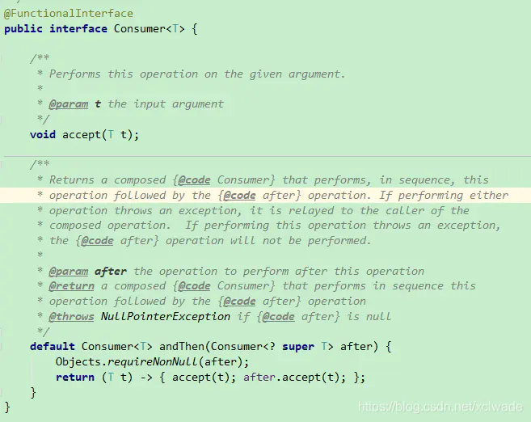

# Lambda表达式、方法引用、Stream流


# 第一章 JDK8新特性

> JDK新特性：
>
> **Lambda 表达式**
>
> **默认方法**【已学习过】
>
> **Stream API** 
>
> **方法引用**
>
> **Base64**


## 1.1 Lambda表达式

### 1.1.1 函数式编程思想概述


​		在数学中，**函数**就是有输入量、输出量的一套计算方案，也就是“拿什么东西做什么事情”。相对而言，面向对象过分强调“必须通过对象的形式来做事情”，而函数式思想则尽量忽略面向对象的复杂语法——**强调做什么，而不是以什么形式做**。


**做什么，而不是怎么做**

​		我们真的希望创建一个匿名内部类对象吗？不。我们只是为了做这件事情而**不得不**创建一个对象。我们真正希望做的事情是：将`compare`方法体内的代码传递给`TreeSet`集合知晓。

​		**传递一段代码**——这才是我们真正的目的。而创建对象只是受限于面向对象语法而不得不采取的一种手段方式。那，有没有更加简单的办法？如果我们将关注点从“怎么做”回归到“做什么”的本质上，就会发现只要能够更好地达到目的，过程与形式其实并不重要。


### 1.1.2 Lambda的优化

​		当需要给Swing的组件添加事件时，例如给JButton按钮绑定鼠标点击事件，需要通过`ActionListener`接口来定义触发事件后执行的操作。

**传统写法,代码如下：**

```java
public class LambdaDemo1 {
	public static void main(String[] args) {
        JButton button = new JButton("按钮");
		button.addActionListener(new ActionListener(){
            @Override
            public void actionPerformed(ActionEvent e){
                System.out.println("按钮被点击了！");
            }
        });
	}
}
```

本着“一切皆对象”的思想，这种做法是无可厚非的：首先创建一个`ActionListener`接口的匿名内部类对象来指定按钮发生鼠标点击事件后执行的操作。


**代码分析:**

对于`ActionListener`的匿名内部类用法，可以分析出几点内容：

- 按钮绑定监听器，需要`ActionListener`接口作为参数，其中的抽象`actionPerformed`方法是用来指定按钮被鼠标点击后执行的操作；
- 为了指定`actionPerformed`的方法体，**不得不**需要`ActionListener`接口的实现类；
- 为了省去定义一个`ActionListener`实现类的麻烦，**不得不**使用匿名内部类；
- 必须覆盖重写抽象`actionPerformed`方法，所以方法名称、方法参数、方法返回值**不得不**再写一遍，且不能写错；
- 而实际上，**似乎只有方法体才是关键所在**。


.png)


**Lambda表达式写法,代码如下：**

借助Java 8的全新语法，上述`ActionListener`接口的匿名内部类写法可以通过更简单的Lambda表达式达到等效：

```java
public class LambdaDemo1 {
	public static void main(String[] args) {
        JButton button = new JButton("按钮");
		
        button.addActionListener(new ActionListener(){
            @Override
            public void actionPerformed(ActionEvent e){
                System.out.println("按钮被点击了！");
            }
        });
        
        //Lambda表达式简化后
        button.addActionListener((ActionEvent e) -> {
       		System.out.println("按钮被点击了！");
        });
	}
}
```

这段代码和刚才的执行效果是完全一样的，可以在1.8或更高的编译级别下通过。从代码的语义中可以看出：按钮触发了鼠标点击事件后执行的操作，而执行的操作以一种更加简洁的形式被指定。

不再有“不得不创建接口对象”的束缚，不再有“抽象方法覆盖重写”的负担，就是这么简单！


### 1.1.3 Lambda的格式

#### 标准格式

Lambda省去面向对象的条条框框，格式由**3个部分**组成：

- 一些参数
- 一个箭头
- 一段代码

Lambda表达式的**标准格式**为：

```
(参数类型 参数名称) -> { 代码语句 }
```

**格式说明：**

- 小括号内的语法与传统方法参数列表一致：无参数则留空；多个参数则用逗号分隔。
- `->`是新引入的语法格式，代表指向动作。
- 大括号内的语法与传统方法体要求基本一致。


**匿名内部类与lambda对比:**

```java
//匿名内部类
button.addActionListener(new ActionListener(){
    @Override
    public void actionPerformed(ActionEvent e){
        System.out.println("按钮被点击了！");
    }
});

//lambda
button.addActionListener((ActionEvent e) -> {
    System.out.println("按钮被点击了！");
});
```

仔细分析该代码中，`ActionListener`接口只有一个`actionPerformed`方法的定义：

- `public abstract void actionPerformed(ActionEvent e);`

即制定了一种做事情的方案（其实就是一个方法）


**总结：lambda表达式简化匿名内部类，首先要求是接口，其次是该接口只有一个抽象方法。**


#### 无参数

- **无参数**：不需要任何条件即可执行该方案。
- **无返回值**：该方案不产生任何结果。
- **代码块**（方法体）：该方案的具体执行步骤。

同样的语义体现在`Lambda`语法中，要更加简单：

```java
//线程中的写法
() -> System.out.println("多线程任务执行！")
```

- 前面的一对小括号即`run`方法的参数（无），代表不需要任何条件；
- 中间的一个箭头代表将前面的参数传递给后面的代码；
- 后面的输出语句即业务逻辑代码。
- 

#### 有参数和返回值

下面举例演示`java.util.Comparator<T>`接口的使用场景代码，其中的抽象方法定义为：

- `public abstract int compare(T o1, T o2);`

当需要对一个对象数组进行排序时，`Arrays.sort`方法需要一个`Comparator`接口实例来指定排序的规则。假设有一个`Person`类，含有`String name`和`int age`两个成员变量：

```java
public class Person { 
    private String name;
    private int age;
    
    // 省略构造器、toString方法与Getter Setter 
}
```


**传统写法**

如果使用传统的代码对`Person[]`数组进行排序，写法如下：

```java
public class LambdaDemo2 {
    public static void main(String[] args) {
      	// 本来年龄乱序的对象数组
        Person[] array = { 
            new Person("古力娜扎", 19),
            new Person("迪丽热巴", 18),       		
            new Person("马尔扎哈", 20) 
        };

      	// 匿名内部类
        Comparator<Person> comp = new Comparator<Person>() {
            @Override
            public int compare(Person o1, Person o2) {
                return o1.getAge() - o2.getAge();
            }
        };
        Arrays.sort(array, comp); // 第二个参数为排序规则，即Comparator接口实例

        for (Person person : array) {
            System.out.println(person);
        }
    }
}
```

这种做法在面向对象的思想中，似乎也是“理所当然”的。其中`Comparator`接口的实例（使用了匿名内部类）代表了“按照年龄从小到大”的排序规则。


**代码分析**

下面我们来搞清楚上述代码真正要做什么事情。

- 为了排序，`Arrays.sort`方法需要排序规则，即`Comparator`接口的实例，抽象方法`compare`是关键；
- 为了指定`compare`的方法体，**不得不**需要`Comparator`接口的实现类；
- 为了省去定义一个`ComparatorImpl`实现类的麻烦，**不得不**使用匿名内部类；
- 必须覆盖重写抽象`compare`方法，所以方法名称、方法参数、方法返回值**不得不**再写一遍，且不能写错；
- 实际上，**只有参数和方法体才是关键**。


**Lambda写法**

```java
public class LambdaDemo2 {
    public static void main(String[] args) {
        Person[] array = {
          	new Person("古力娜扎", 19),
          	new Person("迪丽热巴", 18),
          	new Person("马尔扎哈", 20) 
        };

        // 匿名内部类
        Arrays.sort(array, new Comparator<Person>() {
            @Override
            public int compare(Person o1, Person o2) {
                return o1.getAge() - o2.getAge();
            }
        }); 

        for (Person person : array) {
            System.out.println(person);
        }
        
        System.out.println("--------------------------------");
        
        // Lambda
        Arrays.sort(array, (Person a, Person b) -> {
          	return a.getAge() - b.getAge();
        });

        for (Person person : array) {
            System.out.println(person);
        }
    }
}
```


#### 省略格式

**省略规则**

在Lambda标准格式的基础上，使用省略写法的规则为：

1. 小括号内参数的类型可以省略；
2. 如果小括号内**有且仅有一个参数**，则小括号可以省略；
3. 如果大括号内**有且仅有一个语句**，则无论是否有返回值，都可以省略大括号、语句分号，必须省略return关键字。


**可推导即可省略**

Lambda强调的是“做什么”而不是“怎么做”，所以凡是可以根据上下文推导得知的信息，都可以省略。

例如上例还可以使用Lambda的省略写法：

```java
//Runnable接口简化:
1. () -> System.out.println("多线程任务执行！")

//Comparator接口简化:
2. Arrays.sort(array, (a, b) -> a.getAge() - b.getAge());

//ActionListener接口简化：
3.button.addActionListener(e -> System.out.println("按钮被点击了！"));
```


### 1.1.4 Lambda的前提条件

Lambda的语法非常简洁，完全没有面向对象复杂的束缚。但是使用时有几个问题需要特别注意：

1. 使用Lambda必须具有接口，且要求**接口中有且仅有一个抽象方法**。
   无论是JDK内置的`Runnable`、`Comparator`接口还是自定义的接口，只有当接口中的抽象方法存在且唯一时，才可以使用Lambda。
2. 使用Lambda必须具有**上下文推断**。
   也就是方法的参数或局部变量类型必须为Lambda对应的接口类型，才能使用Lambda作为该接口的实例。

> 备注：有且仅有一个抽象方法的接口，称为“**函数式接口**”。


## 1.2 函数式接口

### 1.2.1 函数式接口概念

​		函数式接口(Functional Interface)就是一个有且仅有一个抽象方法，但是可以有多个非抽象方法的接口。注解`@FunctionalInterface`可以检测接口是否是一个函数式接口。(在合作开发中，避免同事修改此接口造成错误)


### 1.2.2 函数定义及使用

**定义一个函数式接口:**

```java
//问候
@FunctionalInterface
public interface GreetingService {
   void sayMessage();
}
```

 **定义此函数式接口的实现类：** 

```java
public class GreetingServiceImpl implements GreetingService {
    @Override
    public void sayMessage() {
        System.out.println("say hello!");
    }
}
```

 **函数式接口一般作为方法的参数和返回值类型：**

```java
public class Demo {
    //定义一个方法，参数使用函数式接口GreetingService
    public static void show(GreetingService greetingService){
        greetingService.sayMessage();
    }

    public static void main(String[] args) {
        //调用show方法，方法的参数是一个接口，所以可以传递接口的实现类
        show(new GreetingServiceImpl());

        //调用show方法，方法的参数是一个接口，所以可以传递接口的匿名内部类
        show(new GreetingService() {
            @Override
            public void sayMessage() {
                System.out.println("使用匿名内部类重写接口中的抽象方法");
            }
        });
    }
}
```

**lambda表达式的写法：**

```java
public class Demo {
    //定义一个方法，参数使用函数式接口GreetingService
    public static void show(GreetingService greetingService){
        greetingService.sayMessage();
    }

    public static void main(String[] args) {
        //调用show方法，使用lambda表达式
        show(()->System.out.println("使用lambda重写接口中的抽象方法"));
    }
}
```


### 1.2.3 使用lambda表达式的好处

优势：1.简化代码，更为简洁    2.延迟加载

​		有些场景的代码执行后，结果不一定会被使用，从而造成性能浪费。而Lambda表达式是延迟执行的，这正好可以作为解决方案，提升性能。 

例如：**性能浪费的日志案例**
PS：日志可以帮助我们快速的定位问题，记录程序运行过程中的情况，以便项目的监控和优化。

 一种典型的场景就是对参数进行有条件使用，例如对日志消息进行拼接后，在满足条件的情况下进行打印输出：

```java
public class Test {
  public static void main(String[] args) {
    String msgA = "hello";
    String msgB = "world";
    String msgC = "java";
    showLog(1, msgA + msgB + msgC);
  }
  
  private static void showLog(int level, String msg) {
    //当日志级别为1时，打印日志
    if (level == 1) {
      System.out.println(msg);
    }
  }
}
```

这段代码存在问题：无论级别是否满足要求，作为`showLog` 方法的第二个参数，三个字符串一定会首先被拼接并传入方法内，然后才会进行级别判断。如果级别不符合要求，那么字符串的拼接操作就白做了，存在性能浪费。


**使用lambda必然先定义一个函数式接口：**

```java
@FunctionalInterface
interface MessageBuilder{
    String buildMessage();
}
```


 对showLog方法进行改造 

```java
public class Test {
    public static void main(String [] ags){
        String msgA = "hello";
        String msgB = "world";
        String msgC = "java";
        
        //lambda实现显示日志
        showLogLambda(1,()->msgA+msgB+msgC);
        
        //证明lambda表达式的延迟执行
        showLogLambda(1,()->{
            System.out.println("Lambda执行！");
            return msgA+msgB+msgC;
        });
    }
    
    private static void showLogLambda(int level,MessageBuilder builder){
        if(level==1){
            System.out.println(builder.buildMessage());
        }   
    }
}
```

 这样一来，只有当级别满足要求的时候，才会进行三个字符串的拼接；否则三个字符串将不会进行拼接。 


### 1.2.4 常用的函数式接口

​		要使用lambda表达式，我们就要创建一个函数式接口，那每次用lambda表达式的时候岂不是很麻烦，这时候，java给我们内置了`四大核心函数式接口`。

**四大核心函数式接口**

| 函数式接口                   | 参数类型 | 返回类型 | 用途                                        |
| ---------------------------- | -------- | -------- | ------------------------------------------- |
| Supplier< T>接口,供给型接口  | 无       | T        | 返回类型为T的对象，T get()                  |
| Consumer< T>接口，消费型接口 | T        | void     | 对类型为T的对象应用操作，void accept(T t)   |
| Function<T,R> 函数型接口     | T        | R        | 根据类型T的参数获取类型R的结果,R apply(T t) |
| Predicate< T>接口,断定型接口 | T        | boolean  | 用于条件判断的场景,boolean test(T t)        |


#### Supplier< T>接口

​		`java.util.function.Supplier` 接口仅包含一个无参的方法： T get() 。用来获取一个泛型参数指定类型的对象数据。由于这是一个函数式接口，这也就意味着对应的Lambda表达式需要“对外提供”一个符合泛型类型的对象数据。


##### 抽象方法get

```java
public class TestSupplier {
    private static String getString(Supplier<String> function){
        return function.get();  
    }

    public static void main(String[] args) {
        String msgA= "Hello";
        String msgB="World";
        System.out.println(getString(()->msgA+msgB));
  }
}
```

 

#### Consumer< T>接口

​		`java.util.function.Consumer` 接口则正好与Supplier接口相反，它不是生产一个数据，而是消费一个数据，其数据类型由泛型决定。
Consumer提供了accept(T t)的抽象方法，和andThen的默认方法,查看源码如下：

  


##### 抽象方法accept

Consumer 接口中包含抽象方法void accept(T t) ，意为消费一个指定泛型的数据。

基本使用如： 

```java
public class TestConsumer {
    public static void main(String[] args) {
        consumerString(s-> System.out.println(s));
    }
    
    private static void consumerString(Consumer<String> consumer){
        consumer.accept("hello world");
    }
}
```


##### 默认方法andThen

如果一个方法的参数和返回值全都是Consumer 类型，那么就可以实现效果：消费数据的时候，首先做一个操作，然后再做一个操作，实现组合。而这个方法就是Consumer 接口中的default方法andThen 。

```java
public class TestConsumerAndThen {
    public static void main(String[] args) {
        cosumerAndthen(s-> System.out.println(s.toLowerCase()),s-> System.out.println(s.toUpperCase()));
    }

    private static void cosumerAndthen(Consumer<String> one,Consumer<String> two){
        one.andThen(two).accept("hello world");
    }
}
```


#### Function<T,R>接口

 `java.util.function.Function`接口用来根据一个类型的数据得到另一个类型的数据，前者称为前置条件，后者称为后置条件。 


##### 抽象方法apply

Function<T,R>接口中最主要的抽象方法为： R apply(T t) ，根据类型T的参数获取类型R的结果。

```java
//将String类型转换为Integer类型
public class TestFunction {
    public static void main(String[] args) {
        method(s->Integer.parseInt(s));
    }

    private static Integer method(Function<String,Integer> function){
        int num =  function.apply("10");
        System.out.println(num);
        return num;
    }
}
```


##### 默认方法andThen

Function 接口中有一个默认的andThen 方法，用来进行组合操作。该方法同样用于“先做什么，再做什么”的场景，和Consumer 中的andThen 差不多：

```java
//第一个操作是将字符串解析成为int数字，第二个操作是乘以10。两个操作通过andThen按照前后顺序组合到了一起。
public class TestFunctionAndthen {
    public static void main(String[] args) {
        method(s->Integer.parseInt(s) , i->i*10);
    }

    private static void method(Function<String,Integer> one,Function<Integer,Integer> two){
        int num = one.andThen(two).apply("10");
        System.out.println(num);
    }
}
```


#### Predicate< T>接口

有时候我们需要对某种类型的数据进行判断，从而得到一个boolean值结果。这时可以使用
`java.util.function.Predicate`接口。 


##### 抽象方法test

Predicate 接口中包含一个抽象方法： boolean test(T t) 。

用于条件判断的场景： 

```java
public class TestPredicate {
    public static void main(String[] args) {
        method(s -> s.length()>5);
    }
    
    private static void method(Predicate<String> predicate){
        boolean b = predicate.test("HelloWorld");
        System.out.println("字符串很长？"+b);
    }
}
```


##### 默认方法and 与

既然是条件判断，就会存在与、或、非三种常见的逻辑关系。其中将两个Predicate 条件使用“与”逻辑连接起来实现“并且”的效果时，可以使用default方法and.
判断一个字符串既要包含大写“H”，又要包含大写“W”，则：

```java
public class TestPredicateAnd {
    public static void main(String[] args) {
        method(s->s.contains("H"),s->s.contains("W"));

    }
    private static void method(Predicate<String> one,Predicate<String> two){
        boolean b = one.and(two).test("HelloWorld");
        System.out.println("字符串是否符合要求？"+b);

    }
}
```


##### 默认方法or 或

如果希望实现逻辑“字符串包含大写H或者包含大写W”，那么代码只需要将“and”修改为“or”名称即可，其他都不变：

```java
public class TestPredicateOr {
    public static void main(String[] args) {
        method(s->s.contains("H"),s->s.contains("W"));

    }
    private static void method(Predicate<String> one,Predicate<String> two){
        boolean b = one.or(two).test("HelloWorld");
        System.out.println("字符串是否符合要求？"+b);
    }
}
```


##### 默认方法negate 非

“与”、“或”已经了解了，剩下的“非”（取反）也会简单.

```java
public class TestPredicate {
    public static void main(String[] args) {
        method(s->s.length()>5);
    }
    
    private static void method(Predicate<String> predicate){
        boolean b = predicate.negate().test("HelloWorld");
        System.out.println("字符串很长？"+b);
    }
}
```


## 1.3 方法引用

### 1.3.1 方法引用概述

​		方法引用使得开发者可以直接引用现存的方法、Java类的构造方法或者实例对象。方法引用和Lambda表达式配合使用，使得java类的构造方法看起来紧凑而简洁，没有很多复杂的模板代码。


### 1.3.2 静态方法的引用

​		引用格式：

​				类名::静态方法

​		简化步骤：

​				定义一个静态方法，把需要简化的代码放到一个静态方法中。

​		注意事项：

​				被引用的方法的参数列表，要和函数式接口中的抽象方法的参数列表一致。

​				如果函数式接口中的抽象方法有返回值，则被引用的方法必须也有相同的返回值。

​				如果函数式接口中的抽象方法没有返回值，则被引用的方法可以有返回值，也可以没有返回值。

```java
// Lambda
Arrays.sort(array, (Person a, Person b) -> {
    return a.getAge() - b.getAge();
});
//Comparator接口简化:
Arrays.sort(array, (a, b) -> a.getAge() - b.getAge());


//静态方法的引用简化：
public static int compareByAge(Person a, Person b) {
    return a.getAge() - b.getAge();
}
//简化1：
Arrays.sort(array, (a, b) -> Person.compareByAge(a,b));
//简化2：
Arrays.sort(array, Person::compareByAge);
```


### 1.3.3 实例方法的引用

​		引用格式：

​				对象::实例方法

​		简化步骤：

​				定义一个实例方法，把需要的代码放到实例方法中

​		注意事项：

​				被引用的方法的参数列表，要和函数式接口中的抽象方法的参数列表一致。

```java
List<String> list = new ArrayList<>();
list.add("aaa");
list.add("bbb");
list.add("ccc");

//简化1：
list.forEach(s -> System.out.println(s));
//简化2： 对象是System.out=new PrintStream();  实例方法是println()
list.forEach(System.out::println);
```


### 1.3.4 特定类型方法的引用

​		引用格式：

​				特定类型::方法

​		特点类型：

​				String，任何类型

​		注意事项：

​				如果函数式接口中的抽象方法的参数列表中，第一个参数作为了后面的方法的调用者，并且其余参数作		为后面方法的形参，那么就可以用特定类型方法引用了。

```java
Arrays.sort(strs, (String s1 , String s2) -> {
   return s1.compareToIgnoreCase(s2); 
});

//简化1：
Arrays.sort(strs, (s1,s2) -> s1.compareToIgnoreCase(s2));
//简化2：
Arrays.sort(strs, String::compareToIgnoreCase);
```


### 1.3.5 构造器引用

​		引用格式：

​				类名::new

​		注意事项：

​				函数式接口的抽象方法的形参列表和构造器的形参列表一致，抽象方法的返回值类型即为构造器所属的		类的类型。

​				类似于  s -> new Student(s)   => Student::new

```java
//无参构造
Supplier<Employee> sup1 = () -> new Employee();
System.out.println(sup1.get());

System.out.println("----------------------------------------------------");

Supplier<Employee> sup2 = Employee::new;
System.out.println(sup2.get());
```

```java
//有参构造
Function<Integer,Employee> func1 = id -> new Employee(id);
System.out.println(func1.apply(1));

System.out.println("----------------------------------------------------");

Function<Integer,Employee> func2 = Employee::new;
System.out.println(func2.apply(1));
```


数组引用：把数组看成是一个特殊的类，则写法和构造器引用一致

```java
Function<Integer,String[]> func1 = (length)->new String[length];
String[] arr1 = func1.apply(6);
System.out.println(Arrays.toString(arr1));

System.out.println("----------------------------------------------------");

Function<Integer,String[]> func2 = String[]::new;
String[] arr2=func2.apply(1);
System.out.println(Arrays.toString(arr2));
```


# 第二章 Stream

在Java 8中，得益于Lambda所带来的函数式编程，引入了一个**全新的Stream概念**，用于解决已有集合类库既有的弊端。


## 2.1 引言

**传统集合的多步遍历代码**

几乎所有的集合（如`Collection`接口或`Map`接口等）都支持直接或间接的遍历操作。而当我们需要对集合中的元素进行操作的时候，除了必需的添加、删除、获取外，最典型的就是集合遍历。

例如：

```java
public class Demo01ForEach {
    public static void main(String[] args) {
        List<String> list = new ArrayList<>();
        list.add("张无忌");
        list.add("周芷若");
        list.add("赵敏");
        list.add("张强");
        list.add("张三丰");
        for (String name : list) {
          	System.out.println(name);
        }
    }  
}
```

这是一段非常简单的集合遍历操作：对集合中的每一个字符串都进行打印输出操作。


**循环遍历的弊端**

Java 8的Lambda让我们可以更加专注于**做什么**（What），而不是**怎么做**（How），这点此前已经结合内部类进行了对比说明。现在，我们仔细体会一下上例代码，可以发现：

- for循环的语法就是“**怎么做**”
- for循环的循环体才是“**做什么**”

为什么使用循环？因为要进行遍历。但循环是遍历的唯一方式吗？遍历是指每一个元素逐一进行处理，**而并不是从第一个到最后一个顺次处理的循环**。前者是目的，后者是方式。

试想一下，如果希望对集合中的元素进行筛选过滤：

1. 将集合A根据条件一过滤为**子集B**；
2. 然后再根据条件二过滤为**子集C**。

那怎么办？在Java 8之前的做法可能为：

```java
public class Demo02NormalFilter {
  	public static void main(String[] args) {
      	List<String> list = new ArrayList<>();
        list.add("张无忌");
        list.add("周芷若");
        list.add("赵敏");
        list.add("张强");
        list.add("张三丰");

        List<String> zhangList = new ArrayList<>();
        for (String name : list) {
            if (name.startsWith("张")) {
              	zhangList.add(name);
            }
        }

        List<String> shortList = new ArrayList<>();
        for (String name : zhangList) {
            if (name.length() == 3) {
              	shortList.add(name);
            }
        }

        for (String name : shortList) {
          	System.out.println(name);
        }
    }
}
```

这段代码中含有三个循环，每一个作用不同：

1. 首先筛选所有姓张的人；
2. 然后筛选名字有三个字的人；
3. 最后进行对结果进行打印输出。

每当我们需要对集合中的元素进行操作的时候，总是需要进行循环、循环、再循环。这是理所当然的么？**不是。**循环是做事情的方式，而不是目的。另一方面，使用线性循环就意味着只能遍历一次。如果希望再次遍历，只能再使用另一个循环从头开始。

那，Lambda的衍生物Stream能给我们带来怎样更加优雅的写法呢？


**Stream的更优写法**

下面来看一下借助Java 8的Stream API，什么才叫优雅：

```java
public class Demo03StreamFilter {
    public static void main(String[] args) {
        List<String> list = new ArrayList<>();
        list.add("张无忌");
        list.add("周芷若");
        list.add("赵敏");
        list.add("张强");
        list.add("张三丰");

        list.stream()
          	.filter(s -> s.startsWith("张"))
            .filter(s -> s.length() == 3)
            .forEach(System.out::println);
    }
}
```

直接阅读代码的字面意思即可完美展示无关逻辑方式的语义：**获取流、过滤姓张、过滤长度为3、逐一打印**。代码中并没有体现使用线性循环或是其他任何算法进行遍历，我们真正要做的事情内容被更好地体现在代码中。


## 2.2 流式思想概述

**注意：请暂时忘记对传统IO流的固有印象！**

整体来看，流式思想类似于工厂车间的“**生产流水线**”。


当需要对多个元素进行操作（特别是多步操作）的时候，考虑到性能及便利性，我们应该首先拼好一个“模型”步骤方案，然后再按照方案去执行它。

.png)


这张图中展示了过滤、映射、跳过、计数等多步操作，这是一种集合元素的处理方案，而方案就是一种“函数模型”。图中的每一个方框都是一个“流”，调用指定的方法，可以从一个流模型转换为另一个流模型。而最右侧的数字3是最终结果。

这里的`filter`、`map`、`skip`都是在对函数模型进行操作，集合元素并没有真正被处理。只有当终结方法`count`执行的时候，整个模型才会按照指定策略执行操作。而这得益于Lambda的延迟执行特性。

> 备注：“Stream流”其实是一个集合元素的函数模型，它并不是集合，也不是数据结构，其本身并不存储任何元素（或其地址值）。


## 2.3 获取流方式

`java.util.stream.Stream<T>`是Java 8新加入的最常用的流接口。（这并不是一个函数式接口。）

获取一个流非常简单，有以下几种常用的方式：

- 所有的`Collection`集合都可以通过`stream`默认方法获取流；
- `Stream`接口的静态方法`of`可以获取数组对应的流。


**方式1 : 根据Collection获取流**

首先，`java.util.Collection`接口中加入了default方法`stream`用来获取流，所以其所有实现类均可获取流。

```java
import java.util.*;
import java.util.stream.Stream;

public class Demo04GetStream {
    public static void main(String[] args) {
        List<String> list = new ArrayList<>();
        // ...
        Stream<String> stream1 = list.stream();

        Set<String> set = new HashSet<>();
        // ...
        Stream<String> stream2 = set.stream();

        Vector<String> vector = new Vector<>();
        // ...
        Stream<String> stream3 = vector.stream();
    }
}
```


**方式2 : 根据Map获取流**

`java.util.Map`接口不是`Collection`的子接口，且其K-V数据结构不符合流元素的单一特征，所以获取对应的流需要分key、value或entry等情况：

```java
import java.util.HashMap;
import java.util.Map;
import java.util.stream.Stream;

public class Demo05GetStream {
    public static void main(String[] args) {
        Map<String, String> map = new HashMap<>();
        // ...
        Stream<String> keyStream = map.keySet().stream();
        Stream<String> valueStream = map.values().stream();
        Stream<Map.Entry<String, String>> entryStream = map.entrySet().stream();
    }
}
```


**方式3 : 根据数组获取流**

如果使用的不是集合或映射而是数组，由于数组对象不可能添加默认方法，所以`Stream`接口中提供了静态方法`of`，使用很简单：

```java
import java.util.stream.Stream;

public class Demo06GetStream {
    public static void main(String[] args) {
        String[] array = { "张无忌", "张翠山", "张三丰", "张一元" };
        Stream<String> stream = Stream.of(array);
    }
}
```

> 备注：`of`方法的参数其实是一个可变参数，所以支持数组。


## 2.4 常用方法

流模型的操作很丰富，这里介绍一些常用的API。这些方法可以被分成两种：

- **终结方法**：返回值类型不再是`Stream`接口自身类型的方法，因此不再支持类似`StringBuilder`那样的链式调用。本小节中，终结方法包括`count`和`forEach`方法。
- **非终结方法**：返回值类型仍然是`Stream`接口自身类型的方法，因此支持链式调用。（除了终结方法外，其余方法均为非终结方法。）

### 函数拼接与终结方法

在上述介绍的各种方法中，凡是返回值仍然为`Stream`接口的为**函数拼接方法**，它们支持链式调用；而返回值不再为`Stream`接口的为**终结方法**，不再支持链式调用。如下表所示：

| 方法名  | 方法作用   | 方法种类 | 是否支持链式调用 |
| ------- | ---------- | -------- | ---------------- |
| count   | 统计个数   | 终结     | 否               |
| forEach | 逐一处理   | 终结     | 否               |
| filter  | 过滤       | 函数拼接 | 是               |
| limit   | 取用前几个 | 函数拼接 | 是               |
| skip    | 跳过前几个 | 函数拼接 | 是               |
| map     | 映射       | 函数拼接 | 是               |
| concat  | 组合       | 函数拼接 | 是               |

> 备注：本小节之外的更多方法，请自行参考API文档。


### forEach : 逐一处理

虽然方法名字叫`forEach`，但是与for循环中的“for-each”昵称不同，该方法**并不保证元素的逐一消费动作在流中是被有序执行的**。

```java
void forEach(Consumer<? super T> action);
```

该方法接收一个`Consumer`接口函数，会将每一个流元素交给该函数进行处理。例如：

```java
import java.util.stream.Stream;

public class Demo12StreamForEach {
    public static void main(String[] args) {
        Stream<String> stream = Stream.of("张无忌", "张三丰", "周芷若");
        stream.forEach(s->System.out.println(s));
    }
}
```


### count：统计个数

正如旧集合`Collection`当中的`size`方法一样，流提供`count`方法来数一数其中的元素个数：

```java
long count();
```

该方法返回一个long值代表元素个数（不再像旧集合那样是int值）。基本使用：

```java
public class Demo09StreamCount {
    public static void main(String[] args) {
        Stream<String> original = Stream.of("张无忌", "张三丰", "周芷若");
        Stream<String> result = original.filter(s -> s.startsWith("张"));
        System.out.println(result.count()); // 2
    }
}
```


### filter：过滤

可以通过`filter`方法将一个流转换成另一个子集流。方法声明：

```java
Stream<T> filter(Predicate<? super T> predicate);
```

该接口接收一个`Predicate`函数式接口参数（可以是一个Lambda或方法引用）作为筛选条件。

**基本使用**

Stream流中的`filter`方法基本使用的代码如：

```java
public class Demo07StreamFilter {
    public static void main(String[] args) {
        Stream<String> original = Stream.of("张无忌", "张三丰", "周芷若");
        Stream<String> result = original.filter(s -> s.startsWith("张"));
    }
}
```

在这里通过Lambda表达式来指定了筛选的条件：必须姓张。


### limit：取用前几个

`limit`方法可以对流进行截取，只取用前n个。方法签名：

```java
Stream<T> limit(long maxSize);
```

参数是一个long型，如果集合当前长度大于参数则进行截取；否则不进行操作。基本使用：

```java
import java.util.stream.Stream;

public class Demo10StreamLimit {
    public static void main(String[] args) {
        Stream<String> original = Stream.of("张无忌", "张三丰", "周芷若");
        Stream<String> result = original.limit(2);
        System.out.println(result.count()); // 2
    }
}
```


### skip：跳过前几个

如果希望跳过前几个元素，可以使用`skip`方法获取一个截取之后的新流：

```java
Stream<T> skip(long n);
```

如果流的当前长度大于n，则跳过前n个；否则将会得到一个长度为0的空流。基本使用：

```java
import java.util.stream.Stream;

public class Demo11StreamSkip {
    public static void main(String[] args) {
        Stream<String> original = Stream.of("张无忌", "张三丰", "周芷若");
        Stream<String> result = original.skip(2);
        System.out.println(result.count()); // 1
    }
}

```


### map：映射

如果需要将流中的元素映射到另一个流中，可以使用`map`方法。方法签名：

```java
<R> Stream<R> map(Function<? super T, ? extends R> mapper);
```

该接口需要一个`Function`函数式接口参数，可以将当前流中的T类型数据转换为另一种R类型的流。

**基本使用**

Stream流中的`map`方法基本使用的代码如：

```java
import java.util.stream.Stream;

public class Demo08StreamMap {
    public static void main(String[] args) {
        Stream<String> original = Stream.of("10", "12", "18");
        Stream<Integer> result = original.map(s->Integer.parseInt(s));
    }
}
```

这段代码中，`map`方法的参数通过方法引用，将字符串类型转换成为了int类型（并自动装箱为`Integer`类对象）。


### concat：组合

如果有两个流，希望合并成为一个流，那么可以使用`Stream`接口的静态方法`concat`：

```java
static <T> Stream<T> concat(Stream<? extends T> a, Stream<? extends T> b)
```

> 备注：这是一个静态方法，与`java.lang.String`当中的`concat`方法是不同的。

该方法的基本使用代码如：

```java
import java.util.stream.Stream;

public class Demo12StreamConcat {
    public static void main(String[] args) {
        Stream<String> streamA = Stream.of("张无忌");
        Stream<String> streamB = Stream.of("张翠山");
        Stream<String> result = Stream.concat(streamA, streamB);
    }
}
```


## 2.5 Stream综合案例

现在有两个`ArrayList`集合存储队伍当中的多个成员姓名，要求使用传统的for循环（或增强for循环）**依次**进行以下若干操作步骤：

1. 第一个队伍只要名字为3个字的成员姓名；
2. 第一个队伍筛选之后只要前3个人；
3. 第二个队伍只要姓张的成员姓名；
4. 第二个队伍筛选之后不要前2个人；
5. 将两个队伍合并为一个队伍；
6. 根据姓名创建`Person`对象；
7. 打印整个队伍的Person对象信息。

两个队伍（集合）的代码如下：

```java
public class DemoArrayListNames {
    public static void main(String[] args) {
        List<String> one = new ArrayList<>();
        one.add("迪丽热巴");
        one.add("宋远桥");
        one.add("苏星河");
        one.add("老子");
        one.add("庄子");
        one.add("孙子");
        one.add("洪七公");

        List<String> two = new ArrayList<>();
        two.add("古力娜扎");
        two.add("张无忌");
        two.add("张三丰");
        two.add("赵丽颖");
        two.add("张二狗");
        two.add("张天爱");
        two.add("张三");
		// ....
    }
}
```

而`Person`类的代码为：

```java
public class Person {
    
    private String name;

    public Person() {}

    public Person(String name) {
        this.name = name;
    }

    @Override
    public String toString() {
        return "Person{name='" + name + "'}";
    }

    public String getName() {
        return name;
    }

    public void setName(String name) {
        this.name = name;
    }
}
```


### 传统方式

使用for循环 , 示例代码:

```java
public class DemoArrayListNames {
    public static void main(String[] args) {
        List<String> one = new ArrayList<>();
        // ...

        List<String> two = new ArrayList<>();
        // ...

        // 第一个队伍只要名字为3个字的成员姓名；
        List<String> oneA = new ArrayList<>();
        for (String name : one) {
            if (name.length() == 3) {
                oneA.add(name);
            }
        }

        // 第一个队伍筛选之后只要前3个人；
        List<String> oneB = new ArrayList<>();
        for (int i = 0; i < 3; i++) {
            oneB.add(oneA.get(i));
        }

        // 第二个队伍只要姓张的成员姓名；
        List<String> twoA = new ArrayList<>();
        for (String name : two) {
            if (name.startsWith("张")) {
                twoA.add(name);
            }
        }

        // 第二个队伍筛选之后不要前2个人；
        List<String> twoB = new ArrayList<>();
        for (int i = 2; i < twoA.size(); i++) {
            twoB.add(twoA.get(i));
        }

        // 将两个队伍合并为一个队伍；
        List<String> totalNames = new ArrayList<>();
        totalNames.addAll(oneB);
        totalNames.addAll(twoB);

        // 根据姓名创建Person对象；
        List<Person> totalPersonList = new ArrayList<>();
        for (String name : totalNames) {
            totalPersonList.add(new Person(name));
        }

        // 打印整个队伍的Person对象信息。
        for (Person person : totalPersonList) {
            System.out.println(person);
        }
    }
}
```

运行结果为：

```
Person{name='宋远桥'}
Person{name='苏星河'}
Person{name='洪七公'}
Person{name='张二狗'}
Person{name='张天爱'}
Person{name='张三'}
```


### Stream方式

等效的Stream流式处理代码为：

```java
public class DemoStreamNames {
    public static void main(String[] args) {
        List<String> one = new ArrayList<>();
        // ...

        List<String> two = new ArrayList<>();
        // ...

        // 第一个队伍只要名字为3个字的成员姓名；
        // 第一个队伍筛选之后只要前3个人；
        Stream<String> streamOne = one.stream().filter(s -> s.length() == 3).limit(3);

        // 第二个队伍只要姓张的成员姓名；
        // 第二个队伍筛选之后不要前2个人；
        Stream<String> streamTwo = two.stream().filter(s -> s.startsWith("张")).skip(2);

        // 将两个队伍合并为一个队伍；
        // 根据姓名创建Person对象；
        // 打印整个队伍的Person对象信息。
        Stream.concat(streamOne, streamTwo).map(s-> new Person(s)).forEach(s->System.out.println(s));
    }
}
```

运行效果完全一样：

```
Person{name='宋远桥'}
Person{name='苏星河'}
Person{name='洪七公'}
Person{name='张二狗'}
Person{name='张天爱'}
Person{name='张三'}
```


## 2.6 收集Stream结果

对流操作完成之后，如果需要将其结果进行收集，例如获取对应的集合、数组等，如何操作？


### 收集到集合中

Stream流提供`collect`方法，其参数需要一个`java.util.stream.Collector<T,A, R>`接口对象来指定收集到哪种集合中。幸运的是，`java.util.stream.Collectors`类提供一些方法，可以作为`Collector`接口的实例：

- `public static <T> Collector<T, ?, List<T>> toList()`：转换为`List`集合。
- `public static <T> Collector<T, ?, Set<T>> toSet()`：转换为`Set`集合。

下面是这两个方法的基本使用代码：

```java
import java.util.List;
import java.util.Set;
import java.util.stream.Collectors;
import java.util.stream.Stream;

public class Demo15StreamCollect {
    public static void main(String[] args) {
        Stream<String> stream = Stream.of("10", "20", "30", "40", "50");
        List<String> list = stream.collect(Collectors.toList());
        Set<String> set = stream.collect(Collectors.toSet());
    }
}
```


### 收集到数组中

Stream提供`toArray`方法来将结果放到一个数组中，由于泛型擦除的原因，返回值类型是Object[]的：

```java
Object[] toArray();
```

其使用场景如：

```java
import java.util.stream.Stream;

public class Demo16StreamArray {
    public static void main(String[] args) {
        Stream<String> stream = Stream.of("10", "20", "30", "40", "50");
        Object[] objArray = stream.toArray();
    }
}
```
