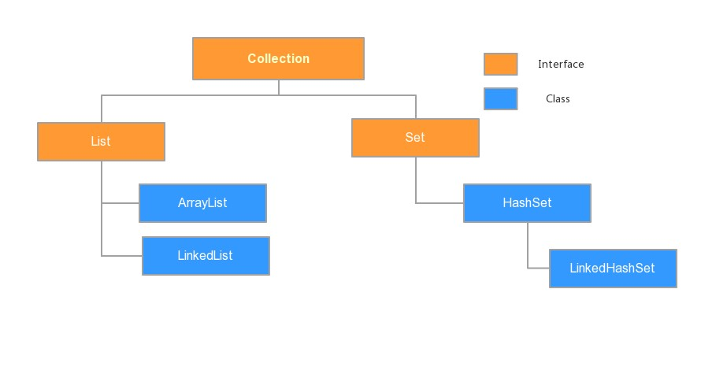
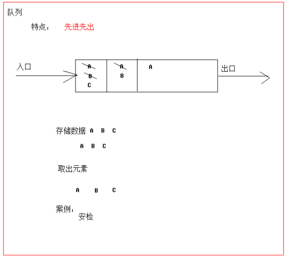
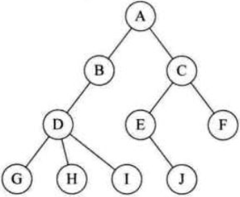
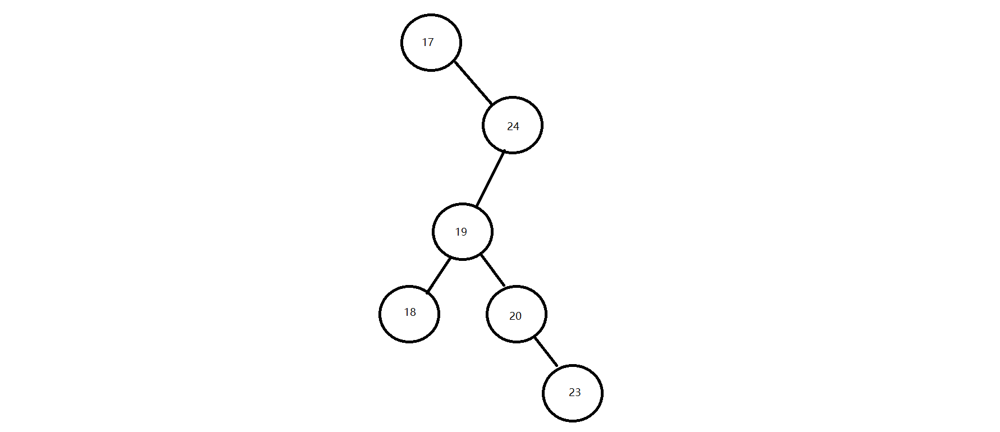
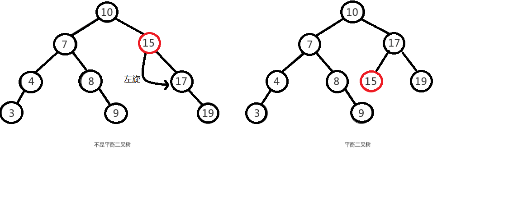
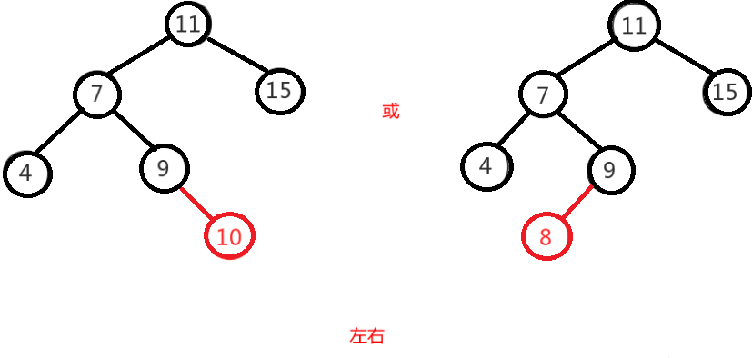
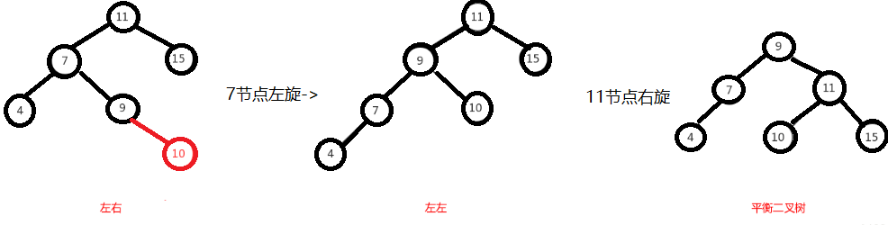
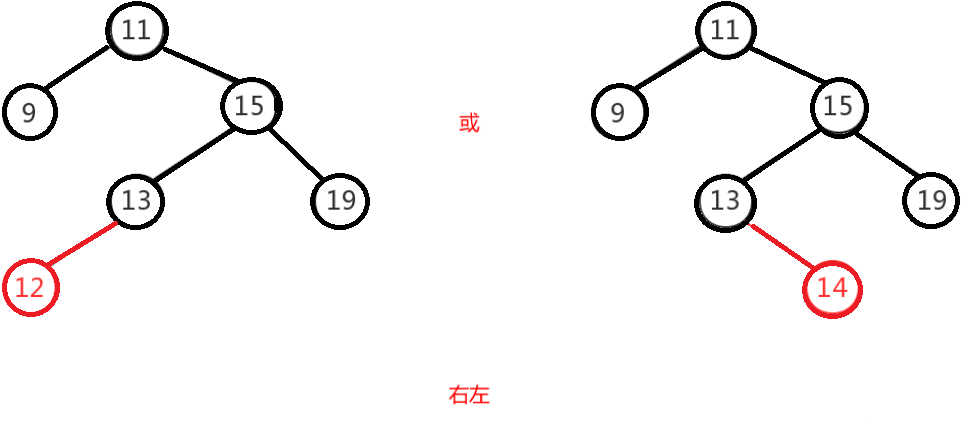
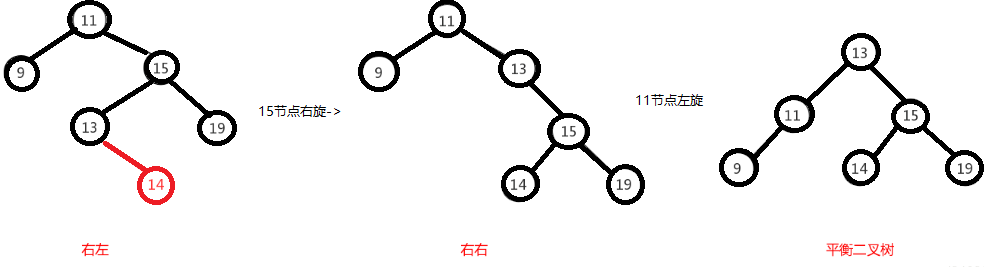
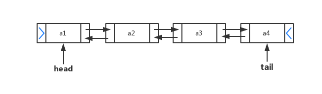

# JavaSE高级 集合框架List&Set

## 主要内容

* 泛型
  * ArrayLIst<Integer> lists = new ArrayList<>();
* **Collection集合：List , Map , Set** 
  * 三天的集合框架（重点内容，开发必用）
* Collection集合的遍历方式:

* 迭代器。
  * foreach(增强for循环)
  * JDK 1.8开始的新技术Lambda表达式。

- 数据结构
  - 是集合的底层，研究数据结构是为了选择使用某种集合。
- List接口
  * 元素是有序可重复有索引的。
- Set接口
  - 元素是无序不重复无索引的。
- Collections是操作集合的工具类。
- 把学的集合用起来：斗地主的游戏。


- [ ] Collection集合的常用功能

  - [ ] ```properties
    Collection集合作为集合的根类，它的功能是一切集合都可以直接使用的。
     - public boolean add(E e)：  把给定的对象添加到当前集合中 。
     - public void clear() :清空集合中所有的元素。
     - public boolean remove(E e): 把给定的对象在当前集合中删除。
     - public boolean contains(Object obj): 判断当前集合中是否包含给定的对象。
     - public boolean isEmpty(): 判断当前集合是否为空。
     - public int size(): 返回集合中元素的个数。
     - public Object[] toArray(): 把集合中的元素，存储到数组中
    ```

- [ ] 使用泛型创建集合对象

  - [ ] ```java
    ArrayList<String> lists = new ArrayList<>(); // JDK 1.7之后泛型的简化写法！
    ArrayList<Integer> lists1 = new ArrayList<>();// JDK 1.7之后泛型的简化写法！
    ```

- [ ] 理解泛型上下限

  - [ ] ? extends Car : ?必须是Car的子类或者本身 。  上限
  - [ ] ? super Car : ?必须是Car的父类或者本身 。  下限   不用的!!

- [ ] 阐述泛型通配符的作用

  - [ ] ? 可以在使用泛型的时候，代表接收一切类型

- [ ] 使用迭代器对集合进行取元素

  - [ ] ```java
    Iterator<String> it = names.iterator();
    while(it.hasNext()){
    	String rs = it.next();
    	System.out.println(rs);
    }
    ```

- [ ] List集合特点

  - [ ] **元素是有序，可重复的，有索引的，底层是基于数组存储元素的，查询快，增删慢！**

- [ ] 常见的数据结构

  - [ ] **队列： 先进先出**
  - [ ] **栈：先进后出，后进先出**
  - [ ] 数组：底层是连续内存区域，查询快，增删慢！
  - [ ] **链表：元素是游离存储的，查询慢，首尾操作快！**
  - [ ] 红黑树 （HastSet ）：增删改查都很好，可以排序，可以提高检索数据的性能！

- [ ] 数组结构特点

  - [ ] **内存中的连续区域，每个区间大小固定，查询快，增删慢!**

- [ ] 栈结构特点

  - [ ] 先进后出。

- [ ] 队列结构特点

  - [ ] 先进先出

- [ ] 单向链表结构特点

  - [ ] 元素是游离存储的，查询慢, 一端的增删操作快！

- [ ] Set集合的特点

  - [ ] 元素是无序，不重复，无索引，底层是基于哈希表存储元素的，曾删查的性能都很好！！

- [ ] 出哈希表的特点

  - [ ] JDK 1.8之前是：链表+数组
  - [ ] JDK 1.8之后是：链表+数组+红黑树

- [ ] 使用HashSet集合存储自定义元素

  - [ ] Set<Apple> sets = new HashSet<>();


# 第1章 泛型

## 1.1  泛型概述

集合中是可以存放任意对象的，只要把对象存储集合后，那么这时他们都会被提升成Object类型。当我们在取出每一个对象，并且进行相应的操作，这时必须采用类型转换。

大家观察下面代码：

~~~java
public class GenericDemo {
	public static void main(String[] args) {
		Collection coll = new ArrayList();
		coll.add("abc");
		coll.add("igeek");
		coll.add(5);//由于集合没有做任何限定，任何类型都可以给其中存放
		Iterator it = coll.iterator();
		while(it.hasNext()){
			//需要打印每个字符串的长度,就要把迭代出来的对象转成String类型
			String str = (String) it.next();
			System.out.println(str.length());
		}
	}
}
~~~

程序在运行时发生了问题**java.lang.ClassCastException**。                                                                                             为什么会发生类型转换异常呢？                                                                                                                                       我们来分析下：由于集合中什么类型的元素都可以存储。导致取出时强转引发运行时 ClassCastException。                                                                                                                                                       怎么来解决这个问题呢？                                                                                                                                                           Collection虽然可以存储各种对象，但实际上通常Collection只存储同一类型对象。例如都是存储字符串对象。因此在JDK5之后，新增了**泛型**(**Generic**)语法，让你在设计API时可以指定类或方法支持泛型，这样我们使用API的时候也变得更为简洁，并得到了编译时期的语法检查。

* **泛型**：可以在类或方法中预支地使用未知的类型。

> tips:一般在创建对象时，将未知的类型确定具体的类型。当没有指定泛型时，默认类型为Object类型。


## 1.2  使用泛型的好处

那么泛型带来了哪些好处呢？

* 将运行时期的ClassCastException，转移到了编译时期变成了编译失败。
* 避免了类型强转的麻烦。

通过我们如下代码体验一下：

~~~java
public class GenericDemo2 {
	public static void main(String[] args) {
        Collection<String> list = new ArrayList<String>();
        list.add("abc");
        list.add("igeek");
        // list.add(5);//当集合明确类型后，存放类型不一致就会编译报错
        // 集合已经明确具体存放的元素类型，那么在使用迭代器的时候，迭代器也同样会知道具体遍历元素类型
        Iterator<String> it = list.iterator();
        while(it.hasNext()){
            String str = it.next();
            //当使用Iterator<String>控制元素类型后，就不需要强转了。获取到的元素直接就是String类型
            System.out.println(str.length());
        }
	}
}
~~~

> tips:泛型是数据类型的一部分，我们将类名与泛型合并一起看做数据类型。


## 1.3  泛型的定义与使用

我们在集合中会大量使用到泛型，这里来完整地学习泛型知识。

泛型，用来灵活地将数据类型应用到不同的**类、方法、接口**当中。将数据类型作为参数进行传递。

### 1.3.1 定义和使用含有泛型的类

定义格式：

~~~
修饰符 class 类名<代表泛型的变量> {  }
~~~

例如，API中的ArrayList集合：

泛型在定义的时候不具体，使用的时候才变得具体。在使用的时候确定泛型的具体数据类型。

~~~java
class ArrayList<E>{ 
    public boolean add(E e){ }

    public E get(int index){ }
   	....
}
~~~

使用泛型： 即什么时候确定泛型。

**在创建对象的时候确定泛型**

 例如，`ArrayList<String> list = new ArrayList<String>();`

此时，变量E的值就是String类型,那么我们的类型就可以理解为：

~~~java 
class ArrayList<String>{ 
     public boolean add(String e){ }

     public String get(int index){  }
     ...
}
~~~

再例如，`ArrayList<Integer> list = new ArrayList<Integer>();`

此时，变量E的值就是Integer类型,那么我们的类型就可以理解为：

~~~java
class ArrayList<Integer> { 
     public boolean add(Integer e) { }

     public Integer get(int index) {  }
     ...
}
~~~


###  1.3.2 含有泛型的方法

定义格式：

~~~
修饰符 <代表泛型的变量> 返回值类型 方法名(参数){  }
~~~

例如，

~~~java
public class MyGenericMethod {	  
    public <MVP> void show(MVP mvp) {
    	System.out.println(mvp.getClass());
    }
    
    public <MVP> MVP show2(MVP mvp) {	
    	return mvp;
    }
}
~~~

**调用方法时，确定泛型的类型**

~~~java
public class GenericMethodDemo {
    public static void main(String[] args) {
        // 创建对象
        MyGenericMethod mm = new MyGenericMethod();
        // 演示看方法提示
        mm.show("aaa");
        mm.show(123);
        mm.show(12.45);
    }
}
~~~


### 1.3.3 含有泛型的接口

定义格式：

~~~
修饰符 interface接口名<代表泛型的变量> {  }
~~~

例如，

~~~java
public interface MyGenericInterface<E>{
	public abstract void add(E e);
	
	public abstract E getE();  
}
~~~

使用格式：

**1、定义类时确定泛型的类型**

例如

~~~java
public class MyImp1 implements MyGenericInterface<String> {
	@Override
    public void add(String e) {
        // 省略...
    }

	@Override
	public String getE() {
		return null;
	}
}
~~~

此时，泛型E的值就是String类型。

 **2、始终不确定泛型的类型，直到创建对象时，确定泛型的类型**

 例如

~~~java
public class MyImp2<E> implements MyGenericInterface<E> {
	@Override
	public void add(E e) {
       	 // 省略...
	}

	@Override
	public E getE() {
		return null;
	}
}
~~~

确定泛型：

~~~java
/*
 * 使用
 */
public class GenericInterface {
    public static void main(String[] args) {
        MyImp2<String>  my = new MyImp2<String>();  
        my.add("aa");
    }
}
~~~


## 1.4  泛型通配符

当使用泛型类或者接口时，传递的数据中，泛型类型不确定，可以通过通配符<?>表示。但是一旦使用泛型的通配符后，只能使用Object类中的共性方法，集合中元素自身方法无法使用。

### 1.4.1 通配符基本使用

泛型的通配符:**不知道使用什么类型来接收的时候,此时可以使用?,?表示未知通配符。**

此时只能接受数据,不能往该集合中存储数据。

举个例子大家理解使用即可：

```java
public static void main(String[] args) {
    Collection<Intger> list1 = new ArrayList<Integer>();
    getElement(list1);
    Collection<String> list2 = new ArrayList<String>();
    getElement(list2);
}
public static void getElement(Collection<?> coll){}
// ？代表可以接收任意类型
泛型不存在继承关系 Collection<Object> list = new ArrayList<String>();这种是错误的
```


### 1.4.2 通配符高级使用

之前设置泛型的时候，实际上是可以任意设置的，只要是类就可以设置。但是在JAVA的泛型中可以指定一个泛型的**上限**和**下限**。

**泛型的上限**：

* **格式**： `类型名称 <? extends 类 > 对象名称`
* **意义**： `只能接收该类型及其子类`

**泛型的下限**：

- **格式**： `类型名称 <? super 类 > 对象名称`
- **意义**： `只能接收该类型及其父类型`

比如：现已知Object类，String 类，Number类，Integer类，其中Number是Integer的父类

~~~java
public static void main(String[] args) {
    Collection<Integer> list1 = new ArrayList<Integer>();
    Collection<String> list2 = new ArrayList<String>();
    Collection<Number> list3 = new ArrayList<Number>();
    Collection<Object> list4 = new ArrayList<Object>();
    
    getElement(list1);
    getElement(list2);//报错
    getElement(list3);
    getElement(list4);//报错
  
    getElement2(list1);//报错
    getElement2(list2);//报错
    getElement2(list3);
    getElement2(list4);
  
}
// 泛型的上限：此时的泛型?，必须是Number类型或者Number类型的子类
public static void getElement1(Collection<? extends Number> coll){}
// 泛型的下限：此时的泛型?，必须是Number类型或者Number类型的父类
public static void getElement2(Collection<? super Number> coll){}
~~~


# 第2章 Collection集合

## 2.1 集合概述

* **集合**：集合是java中提供的一种容器，可以用来存储多个数据。

  ​	集合和数组既然都是容器，它们有什么区别呢？

* 数组的长度是固定的。集合的长度是可变的。
* 数组中存储的是同一类型的元素，可以存储任意类型数据。集合存储的都是引用数据类型。如果想存储基本类型数据需要存储对应的包装类型。


## 2.2  集合常用类的继承体系

Collection：单列集合类的根接口，用于存储一系列符合某种规则的元素，它有两个重要的子接口，分别是`java.util.List`和`java.util.Set`。其中，`List`的特点是元素有序、元素可重复。`Set`的特点是元素不可重复。`List`接口的主要实现类有`java.util.ArrayList`和`java.util.LinkedList`，`Set`接口的主要实现类有`java.util.HashSet`和`java.util.LinkedHashSet`。

从上面的描述可以看出JDK中提供了丰富的集合类库，为了便于初学者进行系统地学习，接下来通过一张图来描述集合常用类的继承体系



注意:这张图只是我们常用的集合有这些，不是说就只有这些集合。

集合本身是一个工具，它存放在java.util包中。在`Collection`接口定义着单列集合框架中最最共性的内容。


## 2.3 Collection 常用API

Collection是所有单列集合的父接口，因此在Collection中定义了单列集合(List和Set)通用的一些方法，这些方法可用于操作所有的单列集合。方法如下：

* `public boolean add(E e)`：  把给定的对象添加到当前集合中 。
* `public void clear()` :清空集合中所有的元素。
* `public boolean remove(E e)`: 把给定的对象在当前集合中删除。
* `public boolean contains(Object obj)`: 判断当前集合中是否包含给定的对象。
* `public boolean isEmpty()`: 判断当前集合是否为空。
* `public int size()`: 返回集合中元素的个数。
* `public Object[] toArray()`: 把集合中的元素，存储到数组中

> tips: 有关Collection中的方法可不止上面这些，其他方法可以自行查看API学习。


# 第3章 Iterator迭代器

## 3.1 Iterator接口

在程序开发中，经常需要遍历集合中的所有元素。针对这种需求，JDK专门提供了一个接口`java.util.Iterator`。

想要遍历Collection集合，那么就要获取该集合迭代器完成迭代操作，下面介绍一下获取迭代器的方法：

* `public Iterator iterator()`: 获取集合对应的迭代器，用来遍历集合中的元素的。

下面介绍一下迭代的概念：

* **迭代**：即Collection集合元素的通用获取方式。在取元素之前先要判断集合中有没有元素，如果有，就把这个元素取出来，继续在判断，如果还有就再取出出来。一直把集合中的所有元素全部取出。这种取出方式专业术语称为迭代。

Iterator接口的常用方法如下：

* `public E next()`:返回迭代的下一个元素。
* `public boolean hasNext()`:如果仍有元素可以迭代，则返回 true。

接下来我们通过案例学习如何使用Iterator迭代集合中元素：

~~~java
public class IteratorDemo {
  	public static void main(String[] args) {
        // 使用多态方式 创建对象
        Collection<String> coll = new ArrayList<String>();

        // 添加元素到集合
        coll.add("串串星人");
        coll.add("吐槽星人");
        coll.add("汪星人");
        //遍历
        //使用迭代器 遍历   每个集合对象都有自己的迭代器
        Iterator<String> it = coll.iterator();
        //  泛型指的是 迭代出 元素的数据类型
        while(it.hasNext()){ //判断是否有迭代元素
            String s = it.next();//获取迭代出的元素
            System.out.println(s);
        }
  	}
}
~~~

> tips: 
>
> 1. 在进行集合元素获取时，如果集合中已经没有元素了，还继续使用迭代器的next方法，将会抛出java.util.NoSuchElementException没有集合元素异常。
> 2. 在进行集合元素获取时，如果添加或移除集合中的元素 , 将无法继续迭代 , 将会抛出==ConcurrentModificationException==并发修改异常.


## 3.2 迭代器的实现原理

我们在之前案例已经完成了Iterator遍历集合的整个过程。当遍历集合时，首先通过调用t集合的iterator()方法获得迭代器对象，然后使用hashNext()方法判断集合中是否存在下一个元素，如果存在，则调用next()方法将元素取出，否则说明已到达了集合末尾，停止遍历元素。

Iterator迭代器对象在遍历集合时，内部采用指针的方式来跟踪集合中的元素，为了让初学者能更好地理解迭代器的工作原理，接下来通过一个图例来演示Iterator对象迭代元素的过程：


在调用Iterator的next方法之前，迭代器的索引位于第一个元素之前，不指向任何元素，当第一次调用迭代器的next方法后，迭代器的索引会向后移动一位，指向第一个元素并将该元素返回，当再次调用next方法时，迭代器的索引会指向第二个元素并将该元素返回，依此类推，直到hasNext方法返回false，表示到达了集合的末尾，终止对元素的遍历。


# 第4章 数据结构

## 4.1 数据结构介绍

数据结构 : 数据用什么样的方式组合在一起。


## 4.2 常见数据结构

数据存储的常用结构有：栈、队列、数组、链表和红黑树。我们分别来了解一下：

#### 栈

- **栈**：**stack**,又称堆栈，它是运算受限的线性表，其限制是仅允许在标的一端进行插入和删除操作，不允许在其他任何位置进行添加、查找、删除等操作。

简单的说：采用该结构的集合，对元素的存取有如下的特点

- 先进后出（即，存进去的元素，要在后它后面的元素依次取出后，才能取出该元素）。例如，子弹压进弹夹，先压进去的子弹在下面，后压进去的子弹在上面，当开枪时，先弹出上面的子弹，然后才能弹出下面的子弹。
- 栈的入口、出口的都是栈的顶端位置。

这里两个名词需要注意：

- **压栈**：就是存元素。即，把元素存储到栈的顶端位置，栈中已有元素依次向栈底方向移动一个位置。
- **弹栈**：就是取元素。即，把栈的顶端位置元素取出，栈中已有元素依次向栈顶方向移动一个位置。

#### 队列

- **队列**：**queue**,简称队，它同堆栈一样，也是一种运算受限的线性表，其限制是仅允许在表的一端进行插入，而在表的另一端进行删除。

简单的说，采用该结构的集合，对元素的存取有如下的特点：

- 先进先出（即，存进去的元素，要在后它前面的元素依次取出后，才能取出该元素）。例如，小火车过山洞，车头先进去，车尾后进去；车头先出来，车尾后出来。
- 队列的入口、出口各占一侧。例如，下图中的左侧为入口，右侧为出口。



#### 数组

- **数组**:**Array**,是有序的元素序列，数组是在内存中开辟一段连续的空间，并在此空间存放元素。就像是一排出租屋，有100个房间，从001到100每个房间都有固定编号，通过编号就可以快速找到租房子的人。

简单的说,采用该结构的集合，对元素的存取有如下的特点：

- 查找元素快：通过索引，可以快速访问指定位置的元素

  

- 增删元素慢

- **指定索引位置增加元素**：需要创建一个新数组，将指定新元素存储在指定索引位置，再把原数组元素根据索引，复制到新数组对应索引的位置。如下图

- **指定索引位置删除元素：**需要创建一个新数组，把原数组元素根据索引，复制到新数组对应索引的位置，原数组中指定索引位置元素不复制到新数组中。如下图


#### 链表

- **链表**:**linked list**,由一系列结点node（链表中每一个元素称为结点）组成，结点可以在运行时i动态生成。每个结点包括两个部分：一个是存储数据元素的数据域，另一个是存储下一个结点地址的指针域。我们常说的链表结构有单向链表与双向链表，那么这里给大家介绍的是**单向链表**。

  

简单的说，采用该结构的集合，对元素的存取有如下的特点：

- 多个结点之间，通过地址进行连接。例如，多个人手拉手，每个人使用自己的右手拉住下个人的左手，依次类推，这样多个人就连在一起了。

- 查找元素慢：想查找某个元素，需要通过连接的节点，依次向后查找指定元素

- 增删元素快：

  树数据结构

  树是有很多节点组成的


## 4.3 树基本结构介绍

树具有的特点：

1. 每一个节点有零个或者多个子节点
2. 没有父节点的节点称之为根节点，**一个树最多有一个根节点。**
3. 每一个非根节点有且只有一个父节点

 

| 名词     | 含义                                                         |
| -------- | ------------------------------------------------------------ |
| 节点     | 指树中的一个元素                                             |
| 节点的度 | 节点拥有的子树的个数，二叉树的度不大于2                      |
| 叶子节点 | 度为0的节点，也称之为终端结点                                |
| 高度     | 叶子节点的高度为1，叶子结点的父节点高度为2，以此类推，根节点的高度最高 |
| 层       | 根节点在第一层，以此类推                                     |
| 父节点   | 若一个节点含有子节点，则这个节点称之为其子节点的父节点       |
| 子节点   | 子节点是父节点的下一层节点                                   |
| 兄弟节点 | 拥有共同父节点的节点互称为兄弟节点                           |


### 二叉树

如果树中的每个节点的子节点的个数不超过2，那么该树就是一个二叉树。


### 二叉查找树/二叉排序树

二叉查找树的特点：

1. 左子树上所有的节点的值均小于等于他的根节点的值
2. 右子树上所有的节点值均大于或者等于他的根节点的值
3. 每一个子节点最多有两个子树

案例演示(20,18,23,22,17,24,19)数据的存储过程；


**增删改查的性能都很高！！！**

遍历获取元素的时候可以按照"左中右"的顺序进行遍历；

注意：二叉查找树存在的问题：会出现"瘸子"的现象，影响查询效率。



### **二叉树的遍历方式** 

二叉树的遍历方式包括三种基本方式：前序遍历、中序遍历和后序遍历。这些遍历方式都是深度优先搜 

索（DFS）的一种，它们描述了访问和处理树节点的顺序。 

1.前序遍历（Preorder Traversal）: 

遍历顺序：根节点 -> 左子树 -> 右子树 

具体操作：首先访问根节点，然后递归地对左子树和右子树进行前序遍历。 

2.中序遍历（Inorder Traversal）: 

遍历顺序：左子树 -> 根节点 -> 右子树 

具体操作：首先递归地对左子树进行中序遍历，然后访问根节点，最后递归地对右子树进行中序遍历。 

3.后序遍历（Postorder Traversal）: 

遍历顺序：左子树 -> 右子树 -> 根节点 

具体操作：首先递归地对左子树和右子树进行后序遍历，然后访问根节点。


前序遍历：1 2 4 5 7 8 3 6 

中序遍历：4 2 7 5 8 1 3 6 

后序遍历：4 7 8 5 2 6 3 1 


### 平衡二叉树

基于查找二叉树，但是让树不要太高，尽量让树的元素均衡分布。这样综合性能就高了

#### 概述

为了避免出现"瘸子"的现象，减少树的高度，提高我们的搜索效率，又存在一种树的结构："平衡二叉树"


#### 规则

**它的左右两个子树的高度差的绝对值不超过1，并且左右两个子树都是一棵平衡二叉树**

如下图所示：


如下图所示，左图是一棵平衡二叉树，根节点10，左右两子树的高度差是1，而右图，虽然根节点左右两子树高度差是0，但是右子树15的左右子树高度差为2，不符合定义，所以右图不是一棵平衡二叉树。


#### 旋转

在构建一棵平衡二叉树的过程中，当有新的节点要插入时，检查是否因插入后而破坏了树的平衡，如果是，则需要做旋转去改变树的结构。


==左旋：==

**左旋就是将节点的右支往左拉，右子节点变成父节点，并把晋升之后多余的左子节点出让给降级节点的右子节点；**


==右旋：==

**将节点的左支往右拉，左子节点变成了父节点，并把晋升之后多余的右子节点出让给降级节点的左子节点**


举个例子，像上图是否平衡二叉树的图里面，左图在没插入前"19"节点前，该树还是平衡二叉树，但是在插入"19"后，导致了"15"的左右子树失去了"平衡"，

所以此时可以将"15"节点进行左旋，让"15"自身把节点出让给"17"作为"17"的左树，使得"17"节点左右子树平衡，而"15"节点没有子树，左右也平衡了。

如下图：

 

由于在构建平衡二叉树的时候，当有**新节点插入**时，都会判断插入后时候平衡，这说明了插入新节点前，都是平衡的，也即高度差绝对值不会超过1。当新节点插入后，有可能会有导致树不平衡，这时候就需要进行调整，而可能出现的情况就有4种，分别称作**左左，左右，右左，右右**。


##### 左左

左左即为在原来平衡的二叉树上，在节点的左子树的左子树下，有新节点插入，导致节点的左右子树的高度差为2，如下即为"10"节点的左子树"7"，的左子树"4"，插入了节点"5"或"3"导致失衡。

 


左左调整其实比较简单，只需要对节点进行右旋即可，如下图，对节点"10"进行右旋，

 


 


##### 左右

左右即为在原来平衡的二叉树上，在节点的左子树的右子树下，有新节点插入，导致节点的左右子树的高度差为2，如上即为"11"节点的左子树"7"，的右子树"9"，插入了节点"10"或"8"导致失衡。

 

左右的调整就不能像左左一样，进行一次旋转就完成调整。我们不妨先试着让左右像左左一样对"11"节点进行右旋，结果图如下，右图的二叉树依然不平衡，而右图就是接下来要讲的右左，即左右跟右左互为镜像，左左跟右右也互为镜像。

 


左右这种情况，进行一次旋转是不能满足我们的条件的，正确的调整方式是，将左右进行第一次旋转，将左右先调整成左左，然后再对左左进行调整，从而使得二叉树平衡。

即先对上图的节点"7"进行左旋，使得二叉树变成了左左，之后再对"11"节点进行右旋，此时二叉树就调整完成，如下图:

 


##### 右左

右左即为在原来平衡的二叉树上，在节点的右子树的左子树下，有新节点插入，导致节点的左右子树的高度差为2，如上即为"11"节点的右子树"15"，的左子树"13"，插入了节点"12"或"14"导致失衡。

 


前面也说了，右左跟左右其实互为镜像，所以调整过程就反过来，先对节点"15"进行右旋，使得二叉树变成右右，之后再对"11"节点进行左旋，此时二叉树就调整完成，如下图:

 


##### 右右

右右即为在原来平衡的二叉树上，在节点的右子树的右子树下，有新节点插入，导致节点的左右子树的高度差为2，如下即为"11"节点的右子树"13"，的左子树"15"，插入了节点"14"或"19"导致失衡。

 


右右只需对节点进行一次左旋即可调整平衡，如下图，对"11"节点进行左旋。

 


### 红黑树

就是平衡的二叉查找树 +  2-3树 /2-3-4树

#### 概述

​		红黑树是一种自平衡的二叉查找树，是计算机科学中用到的一种数据结构，它是在1972年由Rudolf Bayer发明的，当时被称之为平衡二叉B树，后来，在1978年被Leoj.Guibas和Robert Sedgewick修改为如今的"红黑树"。

​		它是一种特殊的二叉查找树，红黑树的每一个节点上都有存储位表示节点的颜色，可以是红或者黑；红黑树不是高度平衡的，它的平衡是通过"红黑树的特性"进行实现的；


#### 红黑树的特性

1. 每一个节点或是红色的，或者是黑色的。
2. 根节点必须是黑色
3. 每个叶节点(Nil)是黑色的；（如果一个节点没有子节点或者父节点，则该节点相应的指针属性值为Nil，这些Nil视为叶节点）
4. 如果某一个节点是红色，那么它的子节点必须是黑色(不能出现两个红色节点相连的情况)
5. 对每一个节点，从该节点到其所有后代叶节点的简单路径上，均包含相同数目的黑色节点；


如下图所示就是一个

 


在进行元素插入的时候，和之前一样； 每一次插入完毕以后，使用黑色规则进行校验，如果不满足红黑规则，就需要通过变色，左旋和右旋来调整树，使其满足红黑规则；


# 第5章 List接口

我们掌握了Collection接口的使用后，再来看看Collection接口中的子类，他们都具备那些特性呢？

接下来，我们一起学习Collection中的常用几个子类（`java.util.List`集合、`java.util.Set`集合）。


## 5.1 List接口介绍

`java.util.List`接口继承自`Collection`接口，是单列集合的一个重要分支，习惯性地会将实现了`List`接口的对象称为List集合。在List集合中允许出现重复的元素，所有的元素是以一种线性方式进行存储的，在程序中可以通过索引来访问集合中的指定元素。另外，List集合还有一个特点就是元素有序，即元素的存入顺序和取出顺序一致。

看完API，我们总结一下：

List接口特点：

1. 它是一个元素存取有序的集合。例如，存元素的顺序是11、22、33。那么集合中，元素的存储就是按照11、22、33的顺序完成的）。
2. 它是一个带有索引的集合，通过索引就可以精确的操作集合中的元素（与数组的索引是一个道理）。
3. 集合中可以有重复的元素，通过元素的equals方法，来比较是否为重复的元素。


## 5.2 List接口中常用方法

List作为Collection集合的子接口，不但继承了Collection接口中的全部方法，而且还增加了一些根据元素索引来操作集合的特有方法，如下：

- `public void add(int index, E element)`: 将指定的元素，添加到该集合中的指定位置上。
- `public E get(int index)`:返回集合中指定位置的元素。
- `public E remove(int index)`: 移除列表中指定位置的元素, 返回的是被移除的元素。
- `public E set(int index, E element)`:用指定元素替换集合中指定位置的元素,返回值的更新前的元素。

List集合特有的方法都是跟索引相关，我们在基础班都学习过。

> tips:我们之前学习Colletion体系的时候，发现List集合下有很多集合，它们的存储结构不同，这样就导致了这些集合它们有各自的特点，供我们在不同的环境下使用，那么常见的数据结构有哪些呢？在下一章我们来介绍：


## 5.3 ArrayList集合

`java.util.ArrayList`集合数据存储的结构是数组结构。元素增删慢，查找快，由于日常开发中使用最多的功能为查询数据、遍历数据，所以`ArrayList`是最常用的集合。

许多程序员开发时非常随意地使用ArrayList完成任何需求，并不严谨，这种用法是不提倡的。


### 课堂练习

```java
List作业
//1.模拟登陆，编写用户类，测试类。
  1>.给集合中存储5个用户对象。
  2>.从控制台输入用户名和密码，和集合中的对象信息进行比较，相同表示成功，不同表示失败。
  3>.有三次输入机会。
    
//2.去除ArrayList集合中重复元素
  1>.存入字符串元素
  2>.存入自定义对象元素（如Person对象）  
    
//3.数组与集合之间转换    
```


## 5.4 LinkedList集合

`java.util.LinkedList`集合数据存储的结构是链表结构。方便元素添加、删除的集合。

> LinkedList是一个双向链表，那么双向链表是什么样子的呢，我们用个图了解下



实际开发中对一个集合元素的添加与删除经常涉及到首尾操作，而LinkedList提供了大量首尾操作的方法。这些方法我们作为**了解即可**：

- `public void addFirst(E e)`:将指定元素插入此列表的开头。
- `public void addLast(E e)`:将指定元素添加到此列表的结尾。
- `public E getFirst()`:返回此列表的第一个元素。
- `public E getLast()`:返回此列表的最后一个元素。
- `public E removeFirst()`:移除并返回此列表的第一个元素。
- `public E removeLast()`:移除并返回此列表的最后一个元素。
- `public E pop()`:从此列表所表示的堆栈处弹出一个元素。
- `public void push(E e)`:将元素推入此列表所表示的堆栈。
- `public boolean isEmpty()`：如果列表不包含元素，则返回true。

LinkedList是List的子类，List中的方法LinkedList都是可以使用，这里就不做详细介绍，我们只需要了解LinkedList的特有方法即可。在开发时，LinkedList集合也可以作为堆栈，队列的结构使用。

```java
public class Demo04LinkedList {
	public static void main(String[] args) {
		method4();
	}
	/*
	 *  void push(E e)： 压入。把元素添加到集合的第一个位置。
	 *  E pop()： 弹出。把第一个元素删除，然后返回这个元素。
	 */
	public static void method4() {
		//创建LinkedList对象
		LinkedList<String> list = new LinkedList<>();
		//添加元素
		list.add("达尔文");
		list.add("达芬奇");
		list.add("达尔优");
		System.out.println("list:" + list);
		//调用push在集合的第一个位置添加元素
		//list.push("爱迪生");
		//System.out.println("list:" + list);//[爱迪生, 达尔文, 达芬奇, 达尔优]
		
		//E pop()： 弹出。把第一个元素删除，然后返回这个元素。
		String value = list.pop();
		System.out.println("value:" + value);//达尔文
		System.out.println("list:" + list);//[达芬奇，达尔优]
	}
	
	/*
	 * E removeFirst()：删除第一个元素
	 * E removeLast()：删除最后一个元素。
	 */
	public static void method3() {
		//创建LinkedList对象
		LinkedList<String> list = new LinkedList<>();
		//添加元素
		list.add("达尔文");
		list.add("达芬奇");
		list.add("达尔优");
		//删除集合的第一个元素
//		String value = list.removeFirst();
//		System.out.println("value:" + value);//达尔文
//		System.out.println("list:" + list);//[达芬奇，达尔优]
		
		//删除最后一个元素
		String value = list.removeLast();
		System.out.println("value:" + value);//达尔优
		System.out.println("list:" + list);//[达尔文， 达芬奇]
	}
	
	/*
	 * E getFirst()： 获取集合中的第一个元素
	 * E getLast()： 获取集合中的最后一个元素
	 */
	public static void method2() {
		//创建LinkedList对象
		LinkedList<String> list = new LinkedList<>();
		//添加元素
		list.add("达尔文");
		list.add("达芬奇");
		list.add("达尔优");
		
		System.out.println("list:" + list);
		//获取集合中的第一个元素
		System.out.println("第一个元素是：" + list.getFirst());
		//获取集合中的最后一个元素怒
		System.out.println("最后一个元素是：" + list.getLast());
	} 
	
	
	/*
	 * void addFirst(E e)： 在集合的开头位置添加元素。
	 * void addLast(E e)： 在集合的尾部添加元素。
	 */
	public static void method1() {
		//创建LinkedList对象
		LinkedList<String> list = new LinkedList<>();
		//添加元素
		list.add("达尔文");
		list.add("达芬奇");
		list.add("达尔优");
		//打印这个集合
		System.out.println("list:" + list);//[达尔文, 达芬奇, 达尔优]
		//调用addFirst添加元素
		list.addFirst("曹操");
		System.out.println("list:" + list);//[曹操, 达尔文, 达芬奇, 达尔优]
		//调用addLast方法添加元素
		list.addLast("大乔");
		System.out.println("list:" + list);//[曹操, 达尔文, 达芬奇, 达尔优, 大乔]
		
	}
}
```


### 课堂练习

```java
//练习1：用LinkedList集合，模拟队列操作(存入的元素是Person对象)

//练习2：用LinkedList集合，模拟堆栈操作(存入的元素是Person对象)
```


## 5.5 ArrayList数组和LinkedList链表实现的原理

### ArrayList

数组实现的特点：查询快，增删慢

原因：

​	查询快：由于数组的索引支持，那么可以通过索引直接计算出元素的地址值，因此就可以直接通过元素的地址值获取到指定的元素

​	增删慢：由于在添加元素的时候，实际上底层会先创建一个新数组(新数组的长度为原数组的长度+1)，那么在添加新元素的时候，先需要对数组中原有的数据进行拷贝，其次在末尾进行添加新的元素。因此，这样操作的效率的极低的(删除元素 刚好和添加的操作相反)


### LinkedList

链表结构：查询慢，增删快

查询慢：由于不能直接找到元素的地址，需要上一个元素推导出下一个元素的地址，这种查询速度较慢。

增删快：在添加的时候，只需要更改元素所记录的地址值即可


# 第6章 Set接口

`java.util.Set`接口和`java.util.List`接口一样，同样继承自`Collection`接口，它与`Collection`接口中的方法基本一致，并没有对`Collection`接口进行功能上的扩充，只是比`Collection`接口更加严格了。与`List`接口不同的是，`Set`接口都会以某种规则保证存入的元素不出现重复。

`Set`集合有多个子类，这里我们介绍其中的`java.util.HashSet`、`java.util.LinkedHashSet`、`java.util.TreeSet`这两个集合。

> tips:Set集合取出元素的方式可以采用：迭代器、增强for。


## 6.1 HashSet集合介绍

`java.util.HashSet`是`Set`接口的一个实现类，它所存储的元素是不可重复的，并且元素都是无序的(即存取顺序不能保证不一致)。`java.util.HashSet`底层的实现其实是一个`java.util.HashMap`支持，由于我们暂时还未学习，先做了解。

`HashSet`是根据对象的哈希值来确定元素在集合中的存储位置，因此具有良好的存储和查找性能。保证元素唯一性的方式依赖于：`hashCode`与`equals`方法。

我们先来使用一下Set集合存储，看下现象，再进行原理的讲解:

```java
public class HashSetDemo {
    public static void main(String[] args) {
        //创建 Set集合
        HashSet<String>  set = new HashSet<String>();

        //添加元素
        set.add(new String("cba"));
        set.add("abc");
        set.add("bac"); 
        set.add("cba");  
        //遍历
        for (String name : set) {
            System.out.println(name);
        }
    }
}
```

输出结果如下，说明集合中不能存储重复元素：

```
cba
abc
bac
```

> tips:根据结果我们发现字符串"cba"只存储了一个，也就是说重复的元素set集合不存储。


## 6.2  HashSet集合存储数据的结构（哈希表）

什么是哈希表呢？

在**JDK1.8**之前，哈希表底层采用**数组+链表**实现，即使用数组处理冲突，同一hash值的链表都存储在一个数组里。但是当位于一个桶中的元素较多，即hash值相等的元素较多时，通过key值依次查找的效率较低。

而**JDK1.8**中，哈希表存储采用**数组+链表+红黑树**实现，当链表长度超过阈值（8）时，将链表转换为红黑树，这样大大减少了查找时间。

简单的来说，哈希表是由数组+链表+红黑树（JDK1.8增加了红黑树部分）实现的，如下图所示。 

看到这张图就有人要问了，这个是怎么存储的呢？

为了方便大家的理解我们结合一个存储流程图来说明一下：


总而言之，**JDK1.8**引入红黑树大程度优化了HashMap的性能，那么对于我们来讲保证HashSet集合元素的唯一，其实就是根据对象的hashCode和equals方法来决定的。如果我们往集合中存放自定义的对象，那么保证其唯一，就必须复写hashCode和equals方法建立属于当前对象的比较方式。


## 6.3  HashSet存储自定义类型元素

给HashSet中存放自定义类型元素时，需要重写对象中的hashCode和equals方法，建立自己的比较方式，才能保证HashSet集合中的对象唯一.

创建自定义Student类:

```java
public class Student {
    private String name;
    private int age;

	//get/set
    @Override
    public boolean equals(Object o) {
        if (this == o)
            return true;
        if (o == null || getClass() != o.getClass())
            return false;
        Student student = (Student) o;
        return age == student.age &&
               Objects.equals(name, student.name);
    }

    @Override
    public int hashCode() {
        return Objects.hash(name, age);
    }
}
```

创建测试类:

```java
public class HashSetDemo2 {
    public static void main(String[] args) {
        //创建集合对象   该集合中存储 Student类型对象
        HashSet<Student> stuSet = new HashSet<Student>();
        //存储 
        Student stu = new Student("于谦", 43);
        stuSet.add(stu);
        stuSet.add(new Student("郭德纲", 44));
        stuSet.add(new Student("于谦", 43));
        stuSet.add(new Student("郭麒麟", 23));
        stuSet.add(stu);

        for (Student stu2 : stuSet) {
            System.out.println(stu2);
        }
    }
}
执行结果：
Student [name=郭德纲, age=44]
Student [name=于谦, age=43]
Student [name=郭麒麟, age=23]
```


## 6.4 LinkedHashSet

我们知道HashSet保证元素唯一，可是元素存放进去是没有顺序的，那么我们要保证有序，怎么办呢？

在HashSet下面有一个子类`java.util.LinkedHashSet`，它是链表和哈希表组合的一个数据存储结构。

演示代码如下:

```java
public class LinkedHashSetDemo {
	public static void main(String[] args) {
		Set<String> set = new LinkedHashSet<String>();
		set.add("bbb");
		set.add("aaa");
		set.add("abc");
		set.add("bbc");
        Iterator<String> it = set.iterator();
		while (it.hasNext()) {
			System.out.println(it.next());
		}
	}
}
结果：
  bbb
  aaa
  abc
  bbc
```


## 6.5 TreeSet集合

### 1. 特点

TreeSet集合是Set接口的一个实现类,底层依赖于TreeMap,是一种基于**红黑树**的实现,其特点为：

1. 元素唯一
2. 元素没有索引
3. 使用元素的[自然顺序](../../java/lang/Comparable.html)对元素进行排序，或者根据创建 TreeSet 时提供的 [`Comparator`](../../java/util/Comparator.html) 比较器
   进行排序，具体取决于使用的构造方法：

```java
public TreeSet()：							根据其元素的自然排序进行排序
public TreeSet(Comparator<E> comparator):    根据指定的比较器进行排序
```


### 2. 演示

案例演示**自然排序**(20,18,23,22,17,24,19):

```java
public static void main(String[] args) {
	//无参构造,默认使用元素的自然顺序进行排序
	TreeSet<Integer> set = new TreeSet<Integer>();
	set.add(20);
	set.add(18);
  	set.add(23);
  	set.add(22);
  	set.add(17);
  	set.add(24);
  	set.add(19);
  	System.out.println(set);
}

控制台的输出结果为:
[17, 18, 19, 20, 22, 23, 24]
```

案例演示**比较器排序**(20,18,23,22,17,24,19):

```java
public static void main(String[] args) {
  	//有参构造,传入比较器,使用比较器对元素进行排序
  	TreeSet<Integer> set = new TreeSet<Integer>(new Comparator<Integer>() {
    	@Override
    	public int compare(Integer o1, Integer o2) {
      		//元素前 - 元素后 : 升序
      		//元素后 - 元素前 : 降序
      		return o2 - o1;
    	}
  	});
  	set.add(20);
  	set.add(18);
  	set.add(23);
  	set.add(22);
  	set.add(17);
  	set.add(24);
  	set.add(19);
  	System.out.println(set);
}

控制台的输出结果为:
[24, 23, 22, 20, 19, 18, 17]
```


## 6.6 课堂练习

```java
//练习1：求一个字符串"aiodjl;hriWFUADJSV123UEHiowfjnivowe"中一共有几个不重复的字母,区分大小写,如a,A算两个字符 （HashSet）

//练习2：TreeSet练习将字符串中的数值进行排序。例如String str="8 10 15 5 2 7";    2,5,7,8,10,15  使用 TreeSet完成。

//练习3.定义一个Person数组，将Person数组中的重复对象剔除 
```


# 第7章  Collections类 - 集合工具类

## 7.1 Collections常用功能

- `java.utils.Collections`是集合工具类，用来对集合进行操作。

  常用方法如下：

- `public static void shuffle(List<?> list) `:打乱集合顺序。

- `public static <T> void sort(List<T> list)`:将集合中元素按照默认规则排序。

- `public static <T> void sort(List<T> list，Comparator<? super T> )`:将集合中元素按照指定规则排序。

代码演示：

```java
public class CollectionsDemo {
    public static void main(String[] args) {
        ArrayList<Integer> list = new ArrayList<Integer>();
   
        list.add(100);
        list.add(300);
        list.add(200);
        list.add(50);
        //排序方法 
        Collections.sort(list);
        System.out.println(list);
    }
}
结果：
[50,100, 200, 300]
```

我们的集合按照默认的自然顺序进行了排列，如果想要指定顺序那该怎么办呢？


## 7.2 Comparator比较器

创建一个学生类，存储到ArrayList集合中完成指定排序操作。

Student 类

```java
public class Student{
    private String name;
    private int age;
	//构造方法
    //get/set
 	//toString
}
```

测试类：

```java
public class Demo {
    public static void main(String[] args) {
        // 创建四个学生对象 存储到集合中
        ArrayList<Student> list = new ArrayList<Student>();

        list.add(new Student("rose",18));
        list.add(new Student("jack",16));
        list.add(new Student("abc",20));
		Collections.sort(list, new Comparator<Student>() {
  		  @Override
    		public int compare(Student o1, Student o2) {
        	return o1.getAge()-o2.getAge();//以学生的年龄升序
   		 }
		});


        for (Student student : list) {
            System.out.println(student);
        }
    }
}
Student{name='jack', age=16}
Student{name='rose', age=18}
Student{name='abc', age=20}
```


## 7.3 可变参数

在**JDK1.5**之后，如果我们定义一个方法需要接受多个参数，并且多个参数类型一致，我们可以对其简化.

**格式：**

```
修饰符 返回值类型 方法名(参数类型... 形参名){  }
```

**代码演示:**

```java
  public class ChangeArgs {
    public static void main(String[] args) {
        int sum = getSum(6, 7, 2, 12, 2121);
        System.out.println(sum);
    }
    
    public static int getSum(int... arr) {
   		int sum = 0;
   	     for (int a : arr) {
         sum += a;
        }
   		 return sum;
    }
}
```

**注意：**

​	1.一个方法只能有一个可变参数

​	2.如果方法中有多个参数，可变参数要放到最后。

**应用场景: Collections**

​	在Collections中也提供了添加一些元素方法：

​	`public static <T> boolean addAll(Collection<T> c, T... elements)  `:往集合中添加一些元素。

**代码演示:**

```java
public class CollectionsDemo {
	public static void main(String[] args) {
      ArrayList<Integer> list = new ArrayList<Integer>();
      //原来写法
      //list.add(12);
      //list.add(14);
      //list.add(15);
      //list.add(1000);
      //采用工具类 完成 往集合中添加元素  
      Collections.addAll(list, 5, 222, 1，2);
      System.out.println(list);
}
```


# 第8章 集合综合案例

## 8.1 案例介绍

按照斗地主的规则，完成**洗牌发牌**的动作。
具体规则：

使用54张牌打乱顺序,三个玩家参与游戏，三人交替摸牌，每人17张牌，最后三张留作底牌。


## 8.2 案例分析

- 准备牌：

  牌可以设计为一个ArrayList<String>,每个字符串为一张牌。
  每张牌由花色数字两部分组成，我们可以使用花色集合与数字集合嵌套迭代完成每张牌的组装。
  牌由Collections类的shuffle方法进行随机排序。

- 发牌

  将每个人以及底牌设计为ArrayList<String>,将最后3张牌直接存放于底牌，剩余牌通过对3取模依次发牌。

- 看牌

  直接打印每个集合。


## 8.3 代码实现

1. Poker.java

```java
public class Poker {
    private String name;

    public Poker() {
    }

    public Poker(String name) {
        this.name = name;
    }

    public String getName() {
        return name;
    }

    public void setName(String name) {
        this.name = name;
    }

    @Override
    public String toString() {
        return "{" + name + "}";
    }
}
```

2 测试类

```java
public class Demo12 {
    public static void main(String[] args) {
        // 创建一个ArrayList用于存放一副牌
        ArrayList<Poker> pokers = new ArrayList<>();
        pokers.add(new Poker("大王", ""));
        pokers.add(new Poker("小王", ""));

        String[] colors = new String[] {"♠", "♥", "♣", "♦"};
        String[] numbers = new String[] {"2", "A", "K", "Q", "J", "10", "9", "8", "7", "6", "5", "4", "3"};
        // 组合牌, 嵌套循环的流程:外循环一次,内循环所有次
        // 2.使用嵌套循环生成一副牌
        for (String n : numbers) {
            // "2", "A"
            for (String c : colors) {
                // "♠", "♥", "♣", "♦"
                Poker p = new Poker(c, n);
                // 3.将54张牌放到集合
                pokers.add(p);
            }
        }

        // 打印
//        System.out.println(pokers);

        // 洗牌: Collections,集合工具类
        // static void shuffle​(List<?> list) 将集合中元素的顺序打乱
        Collections.shuffle(pokers);
        System.out.println("洗牌后:" + pokers);

        // 发牌
        // 1.创建3个玩家集合,创建底牌集合
        ArrayList<Poker> player01 = new ArrayList<>();
        ArrayList<Poker> player02 = new ArrayList<>();
        ArrayList<Poker> player03 = new ArrayList<>();
        ArrayList<Poker> diPai = new ArrayList<>();

        // 2.遍历牌的集合
        //            0     1      2     3     4     5      6     7     8      9     10 ...51    52     53
        // pokers = [♦5], [♣4], [♦8], [♣A], [♣7], [♦2], [♠6], [♣J], [♥A], [♥7], [♥6], [♣5], [♦7], [♥10]
        // 玩家1:   索引0,3,6       索引 % 3 == 0
        // 玩家2:   索引1,4,7       索引 % 3 == 1
        // 玩家3:   索引2,5,8       索引 % 3 == 2
        // 3.根据索引将牌发给不同的玩家
        for (int i = 0; i < pokers.size(); i++) {
            // i表示索引,poker就是i索引对应的poker
            Poker poker = pokers.get(i);
            if (i >= 51) { // 最后3张给底牌
                diPai.add(poker);
            } else if (i % 3 == 0) { // 玩家1
                player01.add(poker);
            } else if (i % 3 == 1) { // 玩家2
                player02.add(poker);
            } else if (i % 3 == 2) { // 玩家3
                player03.add(poker);
            }
        }

        // 看牌
        System.out.println("玩家1: " + player01);
        System.out.println("玩家2: " + player02);
        System.out.println("玩家3: " + player03);
        System.out.println("底牌: " + diPai);

        // 还要创建一副牌
        // 创建一个ArrayList用于存放一副牌
    }
}
```

