## 1.@SpringBootApplication复合注解的作用 

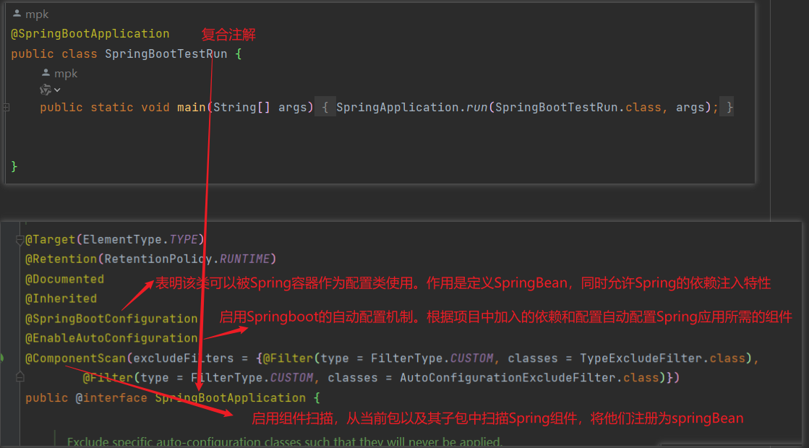


## 2.自动配置原理

###  2.1@EnableAutoConfiguration 

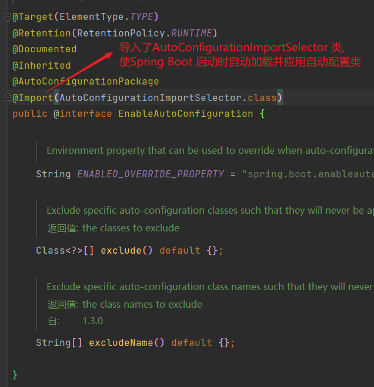

### 2.2AutoConfigurationImportSelector被加载

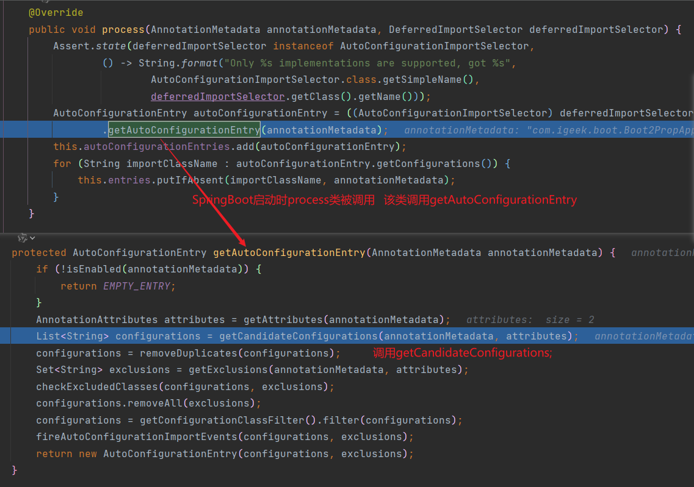

### 2.3 调用 List<String> getCandidateConfigurations(AnnotationMetadata metadata, AnnotationAttributes attributes)

加载META-INF/spring.factories中的文件

以及META-INF/spring/%s.imports中的文件

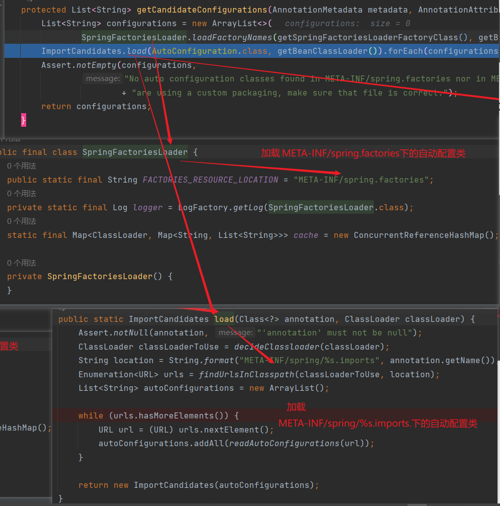


## 3.DispatcherServletAutoConfiguration自动配置分析

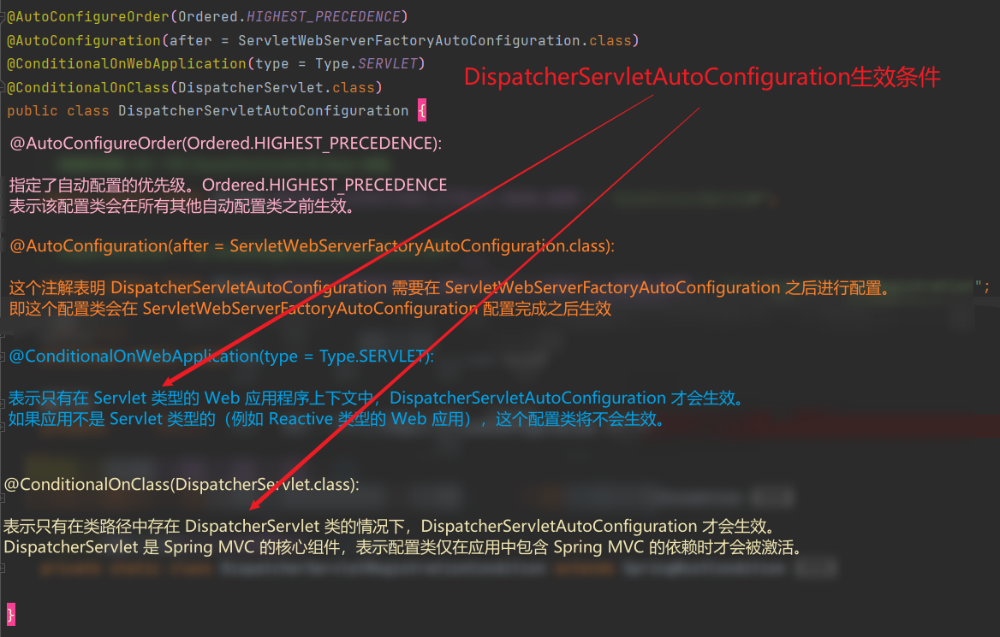

### DispatcherServletAutoConfiguration中含有

### 3.1DispatcherServletConfiguration类

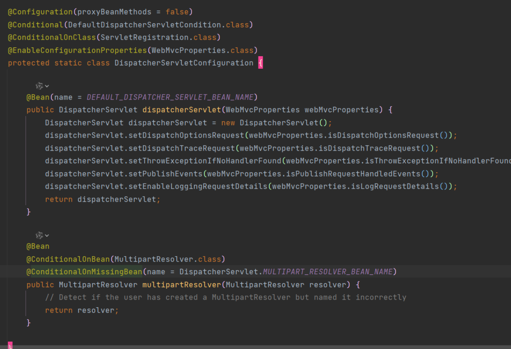

#### `3.1.1 DispatcherServletConfiguration` 类注解的详细解释：

1. **`@Configuration(proxyBeanMethods = false)`**:

   - 这个注解表示 `DispatcherServletConfiguration` 是一个 Spring 配置类。
   - `proxyBeanMethods = false` 表示该配置类中的 `@Bean` 方法不会被代理。意味着 Spring 不会使用 CGLIB 代理来缓存这些方法的结果（通常是为了优化性能）

2. **`@Conditional(DefaultDispatcherServletCondition.class)`**:

   - 注解指示 `DispatcherServletConfiguration` 类的条件性加载。只有当 `DefaultDispatcherServletCondition` 条件满足时，这个配置类才会生效。`DefaultDispatcherServletCondition` 是一个自定义条件类，用于决定是否创建该配置类的 bean。这个条件类通常实现了 `Condition` 接口，并定义了逻辑来判断是否满足生效条件。

3. **`@ConditionalOnClass(ServletRegistration.class)`**:

   - 表示 `DispatcherServletConfiguration` 类仅在类路径中存在 `ServletRegistration` 类的情况下才会生效。`ServletRegistration` 是 Servlet API 中的一个类，因此这个条件确保了配置类仅在存在 Servlet API 的环境中被加载。它通常用于确保只有在包含 Servlet 相关类的情况下才会应用此配置。

4. **`@EnableConfigurationProperties(WebMvcProperties.class)`**:

   - 这个注解启用了 `WebMvcProperties` 类作为配置属性的支持。这意味着 Spring Boot 会将 `WebMvcProperties` 类中的属性从配置文件（如 `application.properties` 或 `application.yml`）中绑定到 `WebMvcProperties` 实例中。它允许该配置类访问和使用这些属性

   - 前缀为spring.mvc

     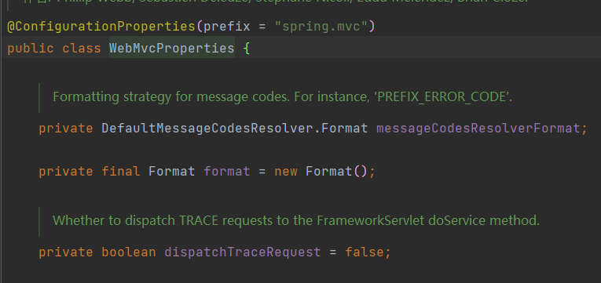

### 综合条件

`DispatcherServletConfiguration` 类的生效条件是：

1. **`DefaultDispatcherServletCondition`**：自定义条件类 `DefaultDispatcherServletCondition` 的条件必须满足。这个条件类通常用于实现特定的逻辑来决定是否加载该配置类。
2. **`ServletRegistration` 类存在**：类路径中必须包含 `ServletRegistration` 类。即应用必须使用 Servlet 规范，并且 Servlet API 的相关依赖必须存在。
3. **`WebMvcProperties` 配置支持**：虽然 `@EnableConfigurationProperties(WebMvcProperties.class)` 不是生效条件的直接部分，但它指示在配置类加载时，会将配置属性绑定到 `WebMvcProperties` 实例中。

综合来说，`DispatcherServletConfiguration` 仅在满足 `DefaultDispatcherServletCondition` 条件且类路径中包含 `ServletRegistration` 类时才会生效。这通常意味着应用是一个基于 Servlet 的 Web 应用，并且 `DefaultDispatcherServletCondition` 条件是为了进一步精确控制配置类的加载时机。

#### 3.1.2 @Bean

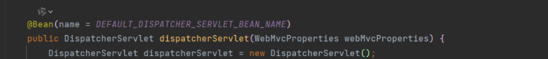

注册了disppatcherServlet ，不可被替换

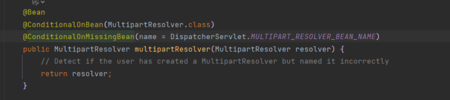

注册了multipartResplver，可以被替换

### 3.2DispatcherServletRegistrationConfiguration类

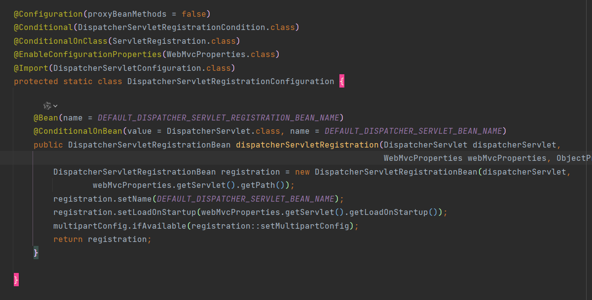

### 生效条件分析

1. **`@Configuration(proxyBeanMethods = false)`**
   - 这是一个标记注解，表示这是一个配置类，用于定义 Spring Bean。
   - `proxyBeanMethods = false` 表示不生成 CGLIB 代理，这是默认设置，主要用于提高性能。
2. **`@Conditional(DispatcherServletRegistrationCondition.class)`**
   - 这个注解表示该配置类的生效依赖于 `DispatcherServletRegistrationCondition` 的条件。
   - `DispatcherServletRegistrationCondition` 是一个自定义的条件类，只有当其 `matches` 方法返回 `true` 时，这个配置类才会生效。这个条件类的具体实现取决于业务需求，通常用于根据某些条件（如环境、配置等）决定是否应用这个配置。
3. **`@ConditionalOnClass(ServletRegistration.class)`**
   - 这个注解表示当类路径中存在 `ServletRegistration` 类时，这个配置类才会生效。
   - `ServletRegistration` 是 Servlet 的注册相关类，通常是与 Servlet API 相关的类，这意味着当项目中有 Servlet API 相关的依赖时，这个配置类才会被应用。
4. **`@EnableConfigurationProperties(WebMvcProperties.class)`**
   - 这个注解用于启用对 `WebMvcProperties` 的配置属性支持。
   - `WebMvcProperties` 是一个配置属性类，用于从配置文件中读取 Web MVC 相关的配置（如 Servlet 路径、启动加载等）。
5. **`@Import(DispatcherServletConfiguration.class)`**
   - 这个注解用于导入其他配置类。
   - `DispatcherServletConfiguration` 可能包含与 `DispatcherServlet` 相关的其他配置，它将会被导入到当前配置类中。
6. **`@Bean(name = DEFAULT_DISPATCHER_SERVLET_REGISTRATION_BEAN_NAME)`**
   - 这是一个 Spring Bean 定义方法，表示返回一个 `DispatcherServletRegistrationBean` 实例。
   - `@ConditionalOnBean` 注解用于判断只有在 `DispatcherServlet` Bean 存在时才创建这个 Bean。
7. **`@ConditionalOnBean(value = DispatcherServlet.class, name = DEFAULT_DISPATCHER_SERVLET_BEAN_NAME)`**
   - 这个注解表示只有当 `DispatcherServlet` Bean 存在并且其名称匹配 `DEFAULT_DISPATCHER_SERVLET_BEAN_NAME` 时，才会创建 `dispatcherServletRegistration` 方法中的 Bean。
   - `DispatcherServlet` 是 Spring MVC 的核心 Servlet，当它存在时才会进行注册。


**这段配置类的生效条件是：**

- 项目中存在 `ServletRegistration` 类。
- `DispatcherServletRegistrationCondition` 条件类的 `matches` 方法返回 `true`。
- `WebMvcProperties` 类可用（由 `@EnableConfigurationProperties` 提供支持）。
- `DispatcherServlet` Bean 存在，并且其名称匹配 `DEFAULT_DISPATCHER_SERVLET_BEAN_NAME`。

## 4.HttpEncodingAutoConfiguration

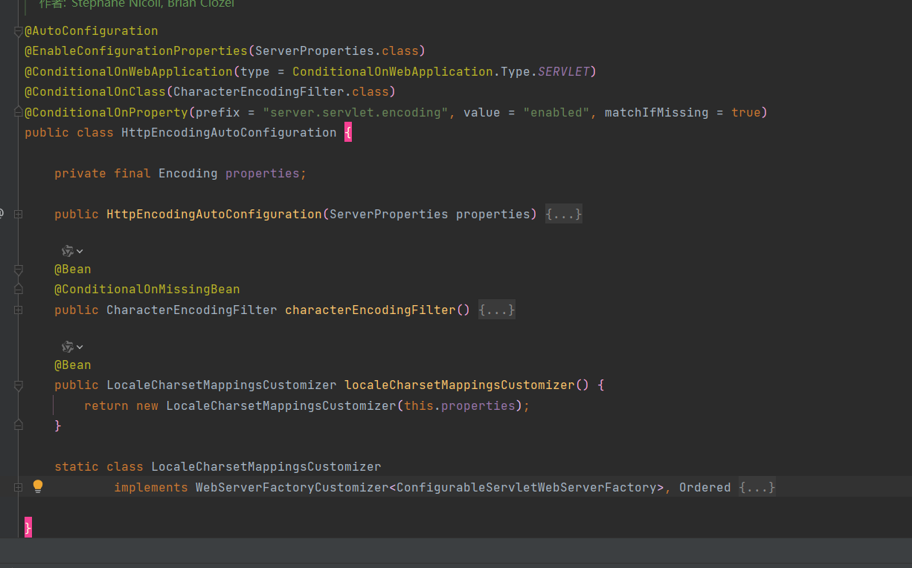

### 4.1. 配置类何时生效？

`HttpEncodingAutoConfiguration` 配置类的生效条件如下：

- **条件注解**：

  - `@ConditionalOnWebApplication(type = ConditionalOnWebApplication.Type.SERVLET)`

    这个注解确保只有在 Servlet 类型的 web 应用中才会生效。

  -  @ConditionalOnClass(CharacterEncodingFilter.class)`

    这个注解检查 `CharacterEncodingFilter` 类是否存在于类路径中。如果存在，配置类才会生效。

  - `@ConditionalOnProperty(prefix = "server.servlet.encoding", value = "enabled", matchIfMissing = true)`：

    这个注解指定了一个属性前缀和属性值（`server.servlet.encoding.enabled`）。如果该属性存在并且值为 `true`，或该属性未设置，则配置类生效。

- **作用**： 配置类会在启动时检查这些条件。如果所有条件都满足，那么 Spring Boot 会自动配置 `CharacterEncodingFilter` 和 `LocaleCharsetMappingsCustomizer`。

### 4.2. 开启配置绑定了什么？使用什么前缀来操作的？

- **绑定的属性**：

  - `Encoding` 对象：配置类通过 `ServerProperties` 的 `getServlet().getEncoding()` 方法获取 `Encoding` 配置。这个对象封装了字符编码的配置，例如字符集和强制编码设置。

- **前缀**：

  - 配置类使用的前缀是

     

    ```
    server.servlet.encoding
    ```

    。例如：

    - `server.servlet.encoding.charset`：定义字符集。
    - `server.servlet.encoding.force-request`：是否强制请求编码。
    - `server.servlet.encoding.force-response`：是否强制响应编码。

### 4.3. `@Bean` 注入了哪些组件？能否自己替换？

- **注入的组件**：

  - ```
    CharacterEncodingFilter：
    ```

    - 通过 `@Bean` 注解，配置类创建并返回一个 `CharacterEncodingFilter` 实例，该实例是 `OrderedCharacterEncodingFilter` 的子类。
    - 该过滤器用于设置 HTTP 请求和响应的字符编码。

  - ```
    LocaleCharsetMappingsCustomizer：
    ```

    - 另一个 `@Bean` 注入的组件。它实现了 `WebServerFactoryCustomizer` 接口，允许自定义 web 服务器的 locale 和 charset 映射。

- **是否可以替换**：

  - **`CharacterEncodingFilter`**：
    - 可以通过定义一个具有相同 bean 名称或类型的自定义 `CharacterEncodingFilter` 来替换。
    - 由于 `@ConditionalOnMissingBean` 注解，只有在没有其他 `CharacterEncodingFilter` bean 时才会创建默认的 `OrderedCharacterEncodingFilter`。
  - **`LocaleCharsetMappingsCustomizer`**：
    - 可以通过定义一个自定义的 `WebServerFactoryCustomizer` bean 来替换。
    - 自定义实现可以调整 locale 和 charset 映射逻辑，允许开发者根据需求进行配置。

## 5.静态资源的默认规则

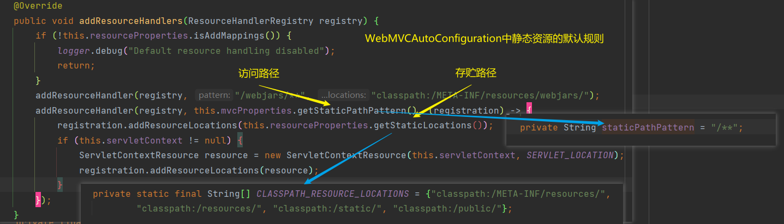

