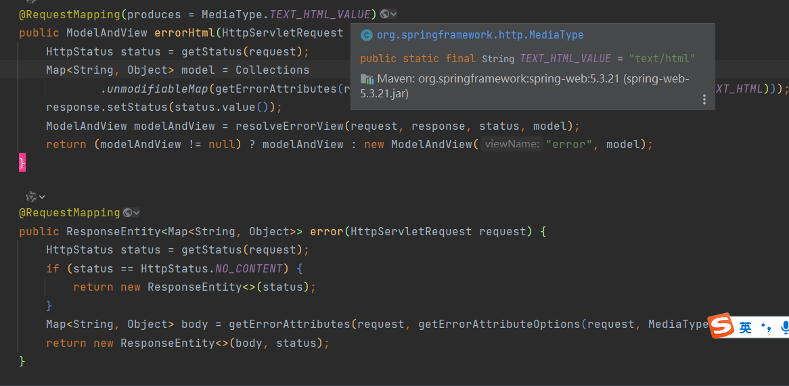
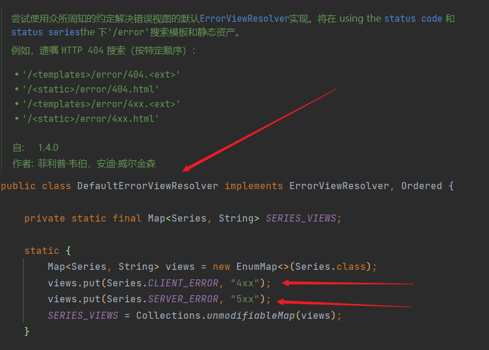

# springboot异常处理

## 1.1 默认规则

Spring Boot 提供了内置的错误处理机制，默认情况下，它通过 `BasicErrorController` 处理错误。主要的默认规则包括：

1. **响应类型**
   
   `BasicErrorController` 中的两个RequestMapping
   
   
   
   浏览器发送请求的时候，我们在控制台可以看到它优先接收 `text/html` 类型的数据，）
   
   
   
   
   

而其它客户端（例如Postman）发送请求的时候，它没有说它要优先接收 `text/html` 类型的数据

   

2. **默认错误响应**

   - 当请求遇到异常或 HTTP 错误状态码时，Spring Boot 会返回一个标准化的 JSON 错误响应。这个响应包括错误状态码、错误类型、错误消息和请求路径。
   - 示例响应格式：
     ```json
     {
         "timestamp": "2024-08-19T12:00:00.000+00:00",
         "status": 404,
         "error": "Not Found",
         "message": "No message available",
         "path": "/some/path"
     }
     ```

3. **默认错误页面**：

   - Spring Boot 提供了简单的 HTML 错误页面用于处理常见的 HTTP 错误（如 404、500）。

   - 错误页面的文件路径通常是 `src/main/resources/templates/error/404.html` 和 `src/main/resources/templates/error/500.html`。

     

   2.1 **DefaultErrorViewResolver 解析流程**，

   结论就是：

   有模板引擎的情况下，将错误页面放在 templates/error/ 即可
   没有模板引擎的情况下，将错误页面放在 静态资源文件夹/error/ 即可
   我们可以使用4xx，5xx作为页面的文件名来匹配这种类型所有的错误，精确优先（因为代码执行顺序优先）

4. **配置默认错误处理**：

   - 可以通过 `application.properties` 或 `application.yml` 配置错误处理行为。例如：
     ```properties
     server.error.whitelabel.enabled=false
     server.error.path=/error
     ```

## 1.2 @ControllerAdvice

`@ControllerAdvice` 是 Spring Framework 提供的一个用于全局异常处理的注解。它可以定义一个全局的异常处理类，该类能够捕获和处理应用程序中所有控制器的异常。

### 功能和用法：

1. **定义全局异常处理**：
   
- 使用 `@ControllerAdvice` 注解的类可以定义全局异常处理方法，这些方法通过 `@ExceptionHandler` 注解来指定处理特定异常的逻辑。
  
2. **示例**：
   ```java
   import org.springframework.http.HttpStatus;
   import org.springframework.http.ResponseEntity;
   import org.springframework.web.bind.annotation.ControllerAdvice;
   import org.springframework.web.bind.annotation.ExceptionHandler;
   import org.springframework.web.bind.annotation.ResponseStatus;

   @ControllerAdvice
   public class GlobalExceptionHandler {

       @ExceptionHandler(ResourceNotFoundException.class)
       @ResponseStatus(HttpStatus.NOT_FOUND)
       public ResponseEntity<String> handleResourceNotFoundException(ResourceNotFoundException ex) {
           return ResponseEntity.status(HttpStatus.NOT_FOUND).body(ex.getMessage());
       }

       @ExceptionHandler(Exception.class)
       @ResponseStatus(HttpStatus.INTERNAL_SERVER_ERROR)
       public ResponseEntity<String> handleGenericException(Exception ex) {
           return ResponseEntity.status(HttpStatus.INTERNAL_SERVER_ERROR).body("An unexpected error occurred");
       }
   }
   ```
   - 在上面的示例中，`handleResourceNotFoundException` 方法会处理 `ResourceNotFoundException` 异常，返回 404 状态码和异常消息。
   - `handleGenericException` 方法会处理所有其他未处理的异常，返回 500 状态码和默认错误消息。

## 1.3 @RestControllerAdvice 并举例

`@RestControllerAdvice` 是 `@ControllerAdvice` 和 `@ResponseBody` 的组合，通常用于处理 RESTful 风格的应用程序中的异常。它能够处理异常，并直接返回 JSON 或其他媒体类型的响应，而不是 HTML 页面。

### 功能和用法：

1. **定义 RESTful 风格的全局异常处理**：
   
- 使用 `@RestControllerAdvice` 注解的类可以定义全局异常处理方法，返回 JSON 格式的错误响应。
  
2. **示例**：
   ```java
   import org.springframework.http.HttpStatus;
   import org.springframework.http.ResponseEntity;
   import org.springframework.web.bind.annotation.RestControllerAdvice;
   import org.springframework.web.bind.annotation.ExceptionHandler;

   @RestControllerAdvice
   public class RestGlobalExceptionHandler {

       @ExceptionHandler(ResourceNotFoundException.class)
       public ResponseEntity<ErrorResponse> handleResourceNotFoundException(ResourceNotFoundException ex) {
           ErrorResponse errorResponse = new ErrorResponse(HttpStatus.NOT_FOUND.value(), ex.getMessage());
           return ResponseEntity.status(HttpStatus.NOT_FOUND).body(errorResponse);
       }

       @ExceptionHandler(Exception.class)
       public ResponseEntity<ErrorResponse> handleGenericException(Exception ex) {
           ErrorResponse errorResponse = new ErrorResponse(HttpStatus.INTERNAL_SERVER_ERROR.value(), "An unexpected error occurred");
           return ResponseEntity.status(HttpStatus.INTERNAL_SERVER_ERROR).body(errorResponse);
       }
   }

   // ErrorResponse class to standardize error responses
   public class ErrorResponse {
       private int status;
       private String message;

       public ErrorResponse(int status, String message) {
           this.status = status;
           this.message = message;
       }

       // Getters and setters
   }
   ```
   - 在上面的示例中，`handleResourceNotFoundException` 方法会处理 `ResourceNotFoundException` 异常，并返回包含状态码和错误消息的 JSON 响应。
   - `handleGenericException` 方法会处理所有其他未处理的异常，并返回通用的 JSON 错误响应。

### 总结

- **默认规则**：Spring Boot 提供了基础的错误处理机制，包括 JSON 错误响应和默认错误页面。
- **@ControllerAdvice**：用于处理控制器中的异常，适合需要返回 HTML 错误页面的情况。
- **@RestControllerAdvice**：用于处理 RESTful 风格应用中的异常，返回 JSON 格式的错误响应。

这些功能和注解使得 Spring Boot 能够有效地处理应用中的异常，确保用户获得明确且有用的错误信息。