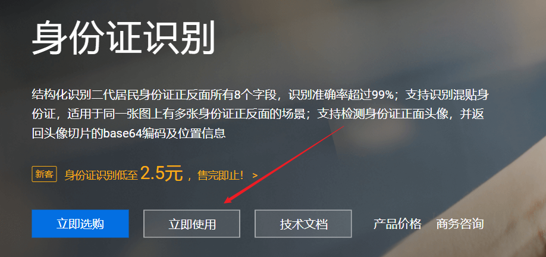
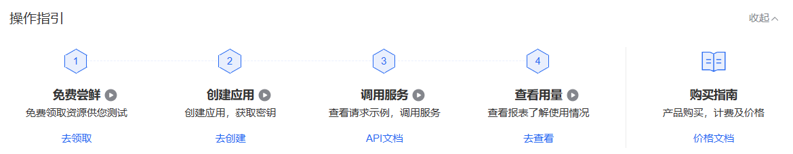
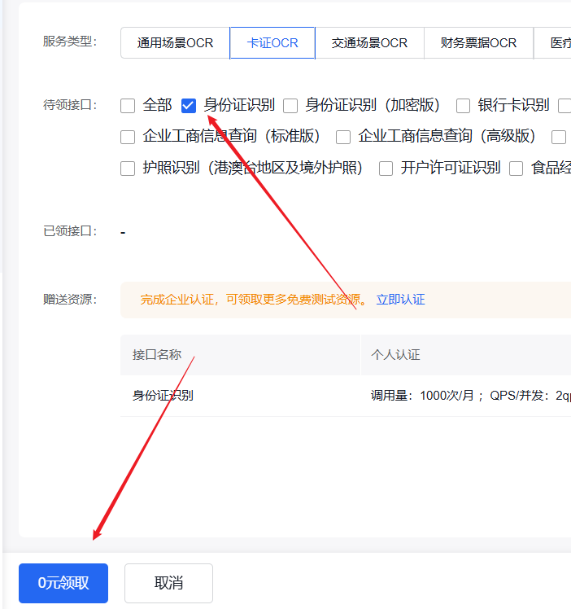
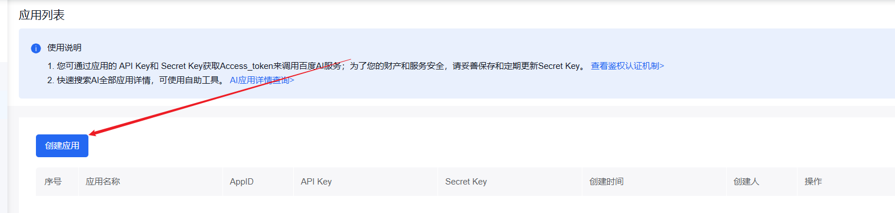
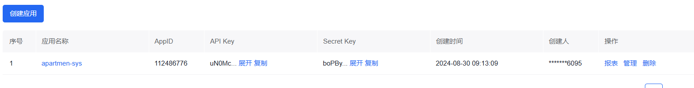

## 1.登录注册账号

 [百度AI开放平台-全球领先的人工智能服务平台 (baidu.com)](https://ai.baidu.com/) 

## 2.进入官网




## 3.官网的调用流程



## 4.免费尝鲜




## 5.创建应用





## 6.springboot使用


### 6.1 导入maven依赖

```xml
<dependency>
     <groupId>com.squareup.okhttp3</groupId>
     <artifactId>okhttp</artifactId>
      <version>4.12.0</version>
  </dependency>
```

### 6.2 工具类

```java
package com.wf.utils;

import cn.hutool.http.HttpUtil;
import cn.hutool.json.JSONObject;
import cn.hutool.json.JSONUtil;
import lombok.extern.slf4j.Slf4j;
import org.springframework.beans.factory.annotation.Value;
import org.springframework.stereotype.Component;

import java.io.IOException;
import java.util.Base64;
import java.util.HashMap;
import java.util.Map;

/**
 * 身份证识别工具类，提供从百度云获取用户身份证信息的功能
 * 通过调用百度云OCR API，识别并返回身份证上的用户信息
 *
 * @author mpk
 * @since 2024/8/30 10:10:21
 */
@Component
@Slf4j
public class IdentificationUtil {

    // 百度云API的Key
    @Value("${baiduyun.api-key}")
    private String appKey;

    // 百度云API的Secret Key
    @Value("${baiduyun.secret-key}")
    private String secretKey;

    /**
     * 通过百度云OCR服务，识别并获取用户身份证信息
     *
     * @param file 身份证图片文件的字节数组
     * @param idCardSide 身份证的面（正面或反面）
     * @return 包含用户信息的Map，如姓名、民族、地址、身份证号和性别
     * @throws IOException 如果文件读取发生错误
     */
    public Map<String, String> getUserInfo(byte[] file, String idCardSide) throws IOException {
        HashMap<String, Object> map = new HashMap<>();
        map.put("id_card_side", idCardSide);
        map.put("image", getFileContentAsBase64(file));
        String post = HttpUtil.post("https://aip.baidubce.com/rest/2.0/ocr/v1/idcard?access_token=" + getAccessToken(), map);
        JSONObject jsonObject = JSONUtil.parseObj(post);
        HashMap<String, String> userInfo = new HashMap<>();
        if (jsonObject.get("words_result") != null) {
            JSONObject wordsResult = jsonObject.getJSONObject("words_result");
            JSONObject nameResult = wordsResult.getJSONObject("姓名");
            String realName = (String) nameResult.get("words");
            JSONObject ethnicGroupResult = wordsResult.getJSONObject("民族");
            String ethnicGroup = (String) ethnicGroupResult.get("words");
            JSONObject addressResult = wordsResult.getJSONObject("住址");
            String address = (String) addressResult.get("words");
            JSONObject idCardResult = wordsResult.getJSONObject("公民身份号码");
            String idCard = (String) idCardResult.get("words");
            JSONObject genderResult = wordsResult.getJSONObject("性别");
            String gender = (String) genderResult.get("words");
            userInfo.put("realName", realName);
            userInfo.put("ethnicGroup", ethnicGroup);
            userInfo.put("address", address);
            userInfo.put("idCard", idCard);
            userInfo.put("gender", gender);
        }
        return userInfo;
    }

    /**
     * 获取文件的Base64编码
     *
     * @param b 文件的字节数组
     * @return 文件内容的Base64编码字符串
     * @throws IOException 如果文件读取发生错误
     */
    static String getFileContentAsBase64(byte[] b) throws IOException {
        return Base64.getEncoder().encodeToString(b);
    }

    /**
     * 使用应用的API Key和Secret Key从百度云获取访问令牌
     *
     * @return 访问百度云API所需的访问令牌
     */
    public String getAccessToken() {
        HashMap<String, Object> map = new HashMap<>();
        map.put("grant_type", "client_credentials");
        map.put("client_id", appKey);
        map.put("client_secret", secretKey);
        String post = HttpUtil.post("https://aip.baidubce.com/oauth/2.0/token", map);
        JSONObject jsonObject = JSONUtil.parseObj(post);
        return (String) jsonObject.get("access_token");
    }
}

```

## 7.controller

```java
package com.wf.controller;

import com.wf.constant.MessageConstant;
import com.wf.exception.ApartmentException;
import com.wf.utils.AliOssUtil;
import com.wf.utils.FileNameUtils;
import com.wf.utils.IdentificationUtil;
import com.wf.vo.Result;
import lombok.extern.slf4j.Slf4j;
import org.springframework.beans.factory.annotation.Autowired;
import org.springframework.web.bind.annotation.CrossOrigin;
import org.springframework.web.bind.annotation.PostMapping;
import org.springframework.web.bind.annotation.RequestPart;
import org.springframework.web.bind.annotation.RestController;
import org.springframework.web.multipart.MultipartFile;

import java.io.IOException;

/**
 * 文件上传接口
 * 处理文件上传相关请求
 */
@Slf4j
@RestController
@CrossOrigin
public class UpLoadController {


    @Autowired
    IdentificationUtil identificationUtil;


    @PostMapping("/uploadIdCard")
    public Result uploadIdCard(@RequestPart MultipartFile file) throws ApartmentException, IOException {

        identificationUtil.getUserInfo(file.getBytes(), "front");

        return Result.success();

    }
}

```


## 8.注意

使用了hutools工具类来简化开发


