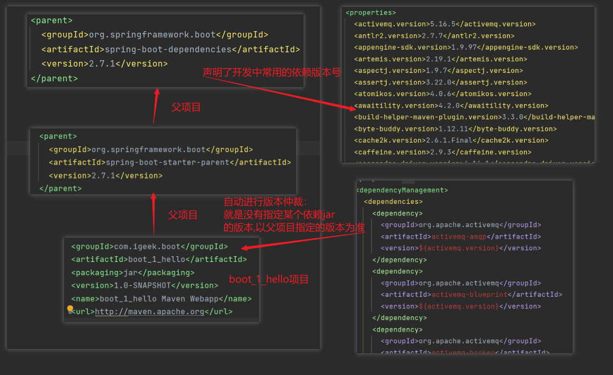

## 1.springBoot依赖管理特性



## 2.SpringBoot中的底层注解和作用

- **`@Configuration`**：标志类为Spring的配置类，定义了一个或多个`@Bean`方法，Spring容器会通过这些方法创建和管理Bean实例。

- **`@Import`**：用于将其他配置类或组件导入当前配置类，从而使得被导入的配置类中的Bean也可以在当前Spring上下文中使用。

- **`@Conditional`**：用于在满足特定条件时才会激活配置或Bean的创建。通过与`Condition`接口配合，可以根据不同的环境或条件来决定是否加载某些Bean。

- **`@ImportResource`**：允许将传统的XML配置文件导入到Spring Boot的应用上下文中，从而可以混合使用Java配置和XML配置。

- **`@ConfigurationProperties`**：将配置文件中的属性（如`application.properties`或`application.yml`）映射到Java对象中。通过在类上使用该注解，可以将配置属性绑定到Bean的字段上，使得配置更加结构化和类型安全。

- 注解的简要示例：

  ### **`@Configuration`**

  ```java
  @Configuration
  public class AppConfig {
      
      @Bean
      public MyService myService() {
          return new MyService();
      }
  }
  ```

  - **解释**：`@Configuration`标记了`AppConfig`类为配置类，`myService`方法创建了一个`MyService` Bean。

  ### **`@Import`**

  ```java
  @Configuration
  @Import(OtherConfig.class)
  public class MainConfig {
  }
  ```

  - **解释**：`@Import`将`OtherConfig`中的配置导入到`MainConfig`中，使得`OtherConfig`中的Bean也在`MainConfig`的上下文中可用。

  ### **`@Conditional`**

  ```java
  @Configuration
  @Conditional(OnDevelopmentCondition.class)
  public class DevConfig {
      // Bean definitions specific to development environment
  }
  ```

  - **解释**：`@Conditional`与`OnDevelopmentCondition`条件配合，`DevConfig`中的配置仅在满足`OnDevelopmentCondition`条件时才会被激活。

  - `@Conditional` 注解的继承类在Spring中用于定义条件化的Bean注册逻辑。

  - 常见的继承类及其作用包括：

    1. **`@ConditionalOnClass`**: 仅当指定的类在类路径中存在时才注册Bean。

       - **作用**: 用于在某个类存在时才加载相关的Bean。

       - 示例:

         ```java
         @ConditionalOnClass(DataSource.class)
         @Configuration
         public class DataSourceConfiguration {
             @Bean
             public DataSource dataSource() {
                 return new DataSource();
             }
         }
         ```

    2. **`@ConditionalOnMissingBean`**: 仅当容器中缺少指定的Bean时才注册Bean。

       - **作用**: 用于在缺少某个Bean时提供默认实现。

       - 示例:

         ```java
         @ConditionalOnMissingBean(MyBean.class)
         @Configuration
         public class MyBeanConfiguration {
             @Bean
             public MyBean myBean() {
                 return new MyBean();
             }
         }
         ```

    3. **`@ConditionalOnProperty`**: 仅当某个属性的值满足指定条件时才注册Bean。

       - **作用**: 用于根据配置属性的值来启用或禁用Bean。

       - 示例:

         ```java
         @ConditionalOnProperty(name = "feature.enabled", havingValue = "true")
         @Configuration
         public class FeatureConfiguration {
             @Bean
             public FeatureService featureService() {
                 return new FeatureService();
             }
         }
         ```

    4. **`@ConditionalOnExpression`**: 仅当指定的SpEL表达式为true时才注册Bean。

       - **作用**: 用于基于SpEL表达式的动态条件来决定Bean的创建。

       - 示例:

         ```java
         @ConditionalOnExpression("#{systemProperties['os.name'].contains('Windows')}")
         @Configuration
         public class WindowsConfiguration {
             @Bean
             public WindowsService windowsService() {
                 return new WindowsService();
             }
         }
         ```

    5. **`@ConditionalOnBean`**: 仅当容器中存在指定的Bean时才注册Bean。

       - **作用**: 用于在某些Bean存在时才创建其他Bean。

       - 示例:

         ```java
         @ConditionalOnBean(DataSource.class)
         @Configuration
         public class DataSourceDependentConfiguration {
             @Bean
             public DataService dataService() {
                 return new DataService();
             }
         }
         ```

    这些条件化注解使得Spring应用程序可以根据不同的环境、配置或依赖条件动态地注册或忽略某些Bean，增强了应用的灵活性和可配置性。

  ### **`@ImportResource`**

  ```java
  @Configuration
  @ImportResource("classpath:beans.xml")
  public class XmlConfig {
  }
  ```

  - **解释**：`@ImportResource`将`beans.xml`中的XML配置导入到Spring应用上下文中，可以与Java配置混合使用。

  ### **`@ConfigurationProperties`**

  ```java
  @Component
  @ConfigurationProperties(prefix = "app")
  public class AppProperties {
      private String name;
      private int timeout;
      
      // Getters and setters
  }
  ```

  - **解释**：`@ConfigurationProperties`将`application.properties`或`application.yml`中以`app`为前缀的配置属性自动绑定到`AppProperties`类的字段上。

  ### **配置文件示例**

  `application.properties`:

  ```properties
  app.name=MyApp
  app.timeout=30
  ```

  - **解释**：上述配置文件中的`app.name`和`app.timeout`将被自动绑定到`AppProperties`类中的对应字段上。

  这些示例展示了如何使用不同的Spring注解来定义配置类、导入配置、控制Bean的加载、结合XML配置和自动绑定配置属性。

## 3.SpringBoot的优点

1. **快速启动**:

   - **优点**: Spring Boot通过提供起步依赖（starters）和自动配置，显著减少了项目初始化的复杂度。
   - **举例**: 使用`spring-boot-starter-web`可以快速构建一个Web应用，只需添加这个依赖，Spring Boot会自动配置Spring MVC、嵌入式Tomcat等。

2. **自动配置**:

   - **优点**: Spring Boot会自动根据应用的依赖和环境配置Spring Beans，简化配置工作。
   - **举例**: 如果你在`pom.xml`中添加了`spring-boot-starter-data-jpa`，Spring Boot会自动配置数据源、EntityManagerFactory等JPA相关组件。

3. **嵌入式服务器**:

   - **优点**: 支持将应用打包成一个独立的JAR文件，包含内嵌的Tomcat、Jetty等Web服务器，无需外部服务器。
   - **举例**: 通过`spring-boot-starter-tomcat`，你可以将整个应用打包成一个JAR，并用`java -jar`命令直接启动它。

4. **生产就绪**:

   - **优点**: 内置Actuator模块提供了健康检查、应用指标、日志等功能，有助于生产环境的监控和管理。
   - **举例**: 使用`spring-boot-starter-actuator`，可以通过`/actuator/health`端点监控应用的健康状态。

5. **约定优于配置**:

   - **优点**: 提供了合理的默认配置，减少了繁琐的自定义设置。
   - **举例**: 默认情况下，Spring Boot将应用配置文件放置于`src/main/resources/application.properties`，并自动加载它们。

6. **模块化**:

   - **优点**: 通过各种启动器（starters）简化了依赖管理和常见功能的集成。
   - **举例**: 使用`spring-boot-starter-security`可以轻松集成Spring Security，提供默认的安全配置。

7. **简化的配置**:

   - **优点**: 配置可以通过`application.properties`或`application.yml`文件集中管理，支持外部化配置。

   - 举例

     : 可以在

     ```
     application.yml
     ```

     中配置数据库连接：

     ```
     yamlspring:
       datasource:
         url: jdbc:mysql://localhost:3306/mydb
         username: user
         password: pass
     ```

8. **社区支持**:

   - **优点**: 作为Spring生态的一部分，Spring Boot拥有广泛的社区支持和丰富的文档资源。
   - **举例**: 你可以访问Spring Boot的官方文档、社区论坛和GitHub上的示例代码来解决开发中的问题。

这些优点使得Spring Boot在开发现代Java应用时特别高效和便捷。

## 4.个人git网址


 [springBootA/src/main · 马朋坤/SpringBootLearn - 码云 - 开源中国 (gitee.com)](https://gitee.com/ma-pengkun/spring-boot-learn/tree/master/springBootA/src/main) 