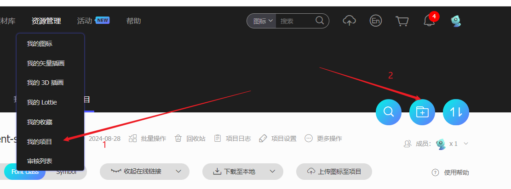
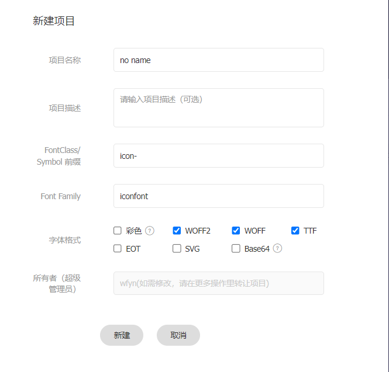
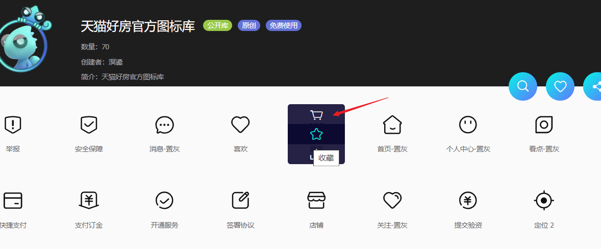
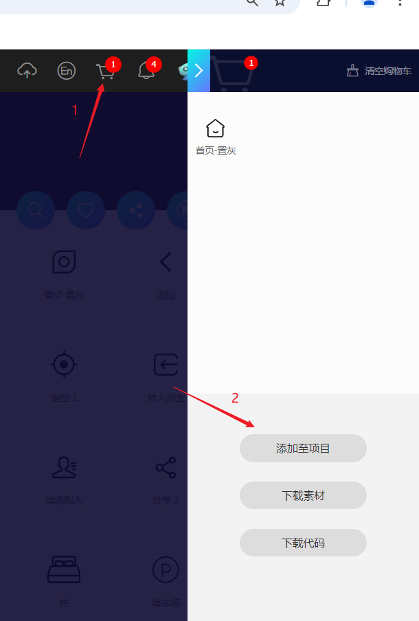
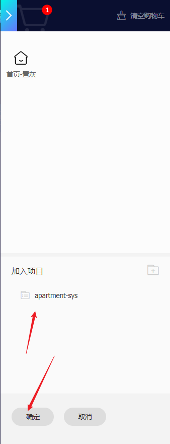
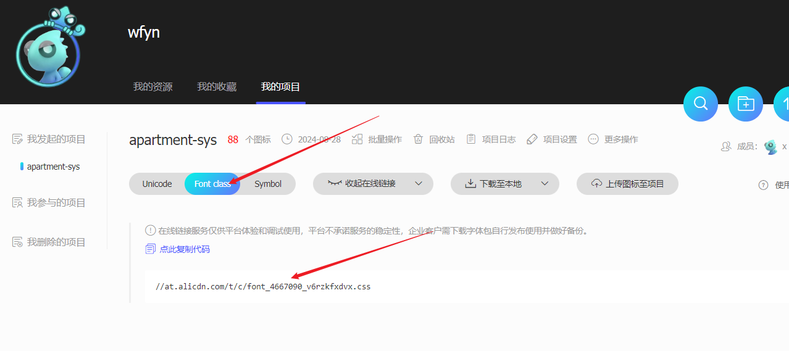

### 1.进入官网注册用户

https://www.iconfont.cn/

### 2.进入我的项目新建项目




### 3.填写项目信息




### 4.图标点击购物车



>

### 5.添加进项目中






### 6.生成css文件，网页访问打开它



### 7.这是源文件

```scss
@font-face {
  font-family: "iconfont"; /* Project id 4667090 */
  src: url('//at.alicdn.com/t/c/font_4667090_v6rzkfxdvx.woff2?t=1724833352572') format('woff2'),
       url('//at.alicdn.com/t/c/font_4667090_v6rzkfxdvx.woff?t=1724833352572') format('woff'),
       url('//at.alicdn.com/t/c/font_4667090_v6rzkfxdvx.ttf?t=1724833352572') format('truetype');
}

.iconfont {
  font-family: "iconfont" !important;
  font-size: 16px;
  font-style: normal;
  -webkit-font-smoothing: antialiased;
  -moz-osx-font-smoothing: grayscale;
}

.icon-bangzhu:before {
  content: "\e8ac";
}
.....
```

### 8.对文件稍加改造

```scss
@font-face {
        font-family: "iconfont"; /* Project id 4667090 */
        src: url('//at.alicdn.com/t/c/font_4667090_v6rzkfxdvx.woff2?t=1724833352572') format('woff2'),
        url('//at.alicdn.com/t/c/font_4667090_v6rzkfxdvx.woff?t=1724833352572') format('woff'),
        url('//at.alicdn.com/t/c/font_4667090_v6rzkfxdvx.ttf?t=1724833352572') format('truetype');
        }

[class^='icon-'],
[class*=' icon-'] {
  font-family: 'iconfont' !important;
  font-style: normal;
  -webkit-font-smoothing: antialiased;
  -moz-osx-font-smoothing: grayscale;
}


      
.icon-bangzhu:before {
    content: "\e8ac";
}
......

```

### 9.在页面中使用

```vue
<template>
<view class="icon-bangzhu">
</view>
</template>
```

### 10.完工