## 阿里云 OSS 

### 1. 进入官网

访问阿里云官方网站以获取更多信息和资源：[阿里云官网](https://cn.aliyun.com/)

### 2. 注册阿里账号并进行实名认证

在官网上注册账号，并完成实名认证以获得阿里云服务的访问权限。

### 3. 查看 API 文档

查看阿里云 OSS 的 API 文档以了解详细的使用方法和接口信息：[OSS 快速入门](https://help.aliyun.com/zh/oss/getting-started/getting-started-with-oss?spm=a2c4g.11186623.0.0.3a1197f0kBdrpT#section-0bb-c7c-qsn)

### 4. 控制台操作流程

查看详细的控制台操作流程：[控制台快速入门](https://help.aliyun.com/zh/oss/getting-started/console-quick-start?spm=a2c4g.11186623.0.0.43f123bfXADCbw)

#### 4.1 开通 OSS 服务

在阿里云控制台中开通 OSS 服务。

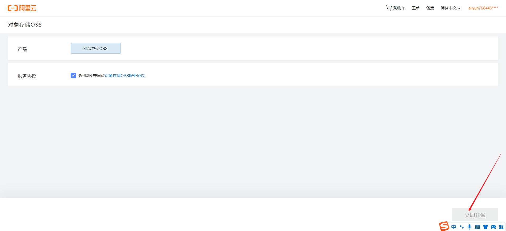

#### 4.2 创建存储空间

在 OSS 控制台中创建存储空间（Bucket）。

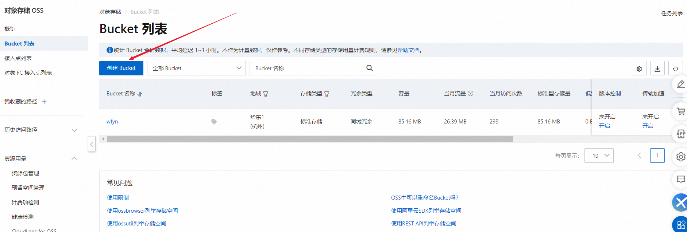

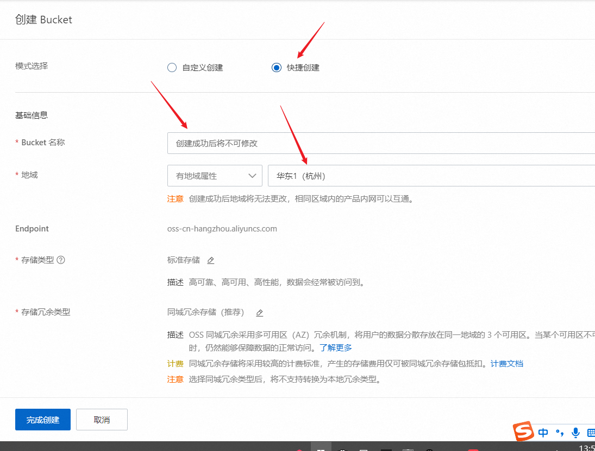

#### 4.3 上传文件

使用 OSS 控制台上传文件到创建的存储空间。

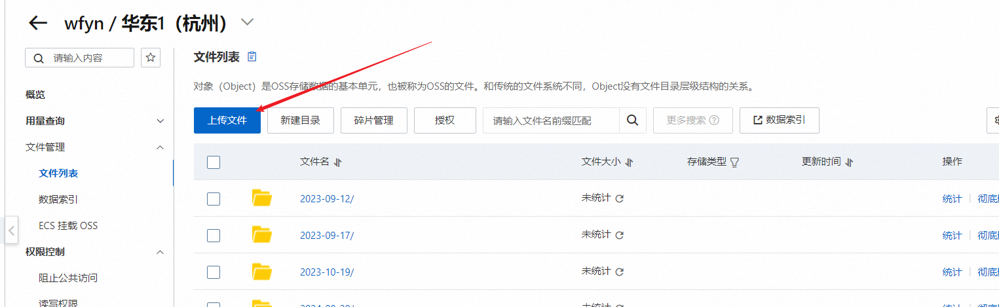

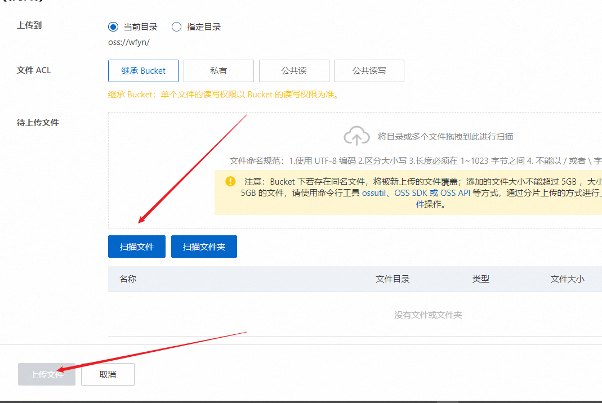

### 5. 使用 Java SDK 操作流程

#### 5.1 安装 SDK

从阿里云官方网站下载并安装 Java SDK。

在Maven工程中使用OSS Java SDK，只需在pom.xml中加入相应依赖即可。以在<dependencies>中加入3.17.4版本的依赖为例：

```xml
<dependency>
    <groupId>com.aliyun.oss</groupId>
    <artifactId>aliyun-sdk-oss</artifactId>
    <version>3.17.4</version>
</dependency>
```

如果使用的是Java 9及以上的版本，则需要添加JAXB相关依赖。添加JAXB相关依赖示例代码如下：

```xml
<dependency>
    <groupId>javax.xml.bind</groupId>
    <artifactId>jaxb-api</artifactId>
    <version>2.3.1</version>
</dependency>
<dependency>
    <groupId>javax.activation</groupId>
    <artifactId>activation</artifactId>
    <version>1.1.1</version>
</dependency>
<!-- no more than 2.3.3-->
<dependency>
    <groupId>org.glassfish.jaxb</groupId>
    <artifactId>jaxb-runtime</artifactId>
    <version>2.3.3</version>
</dependency>
```

#### 5.2 配置访问凭证

##### 5.2.1 创建用户

在控制台中创建用户，并为用户分配相应的权限。

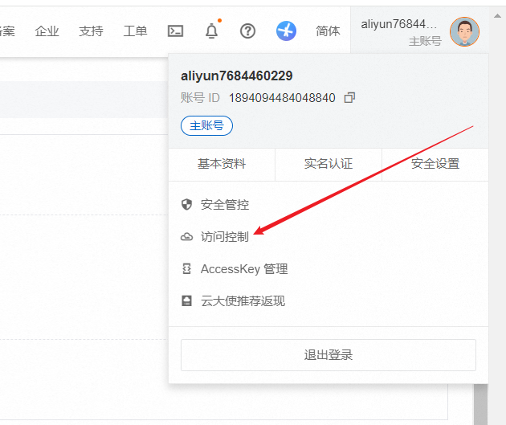

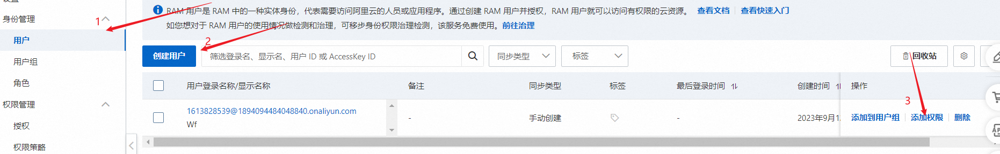

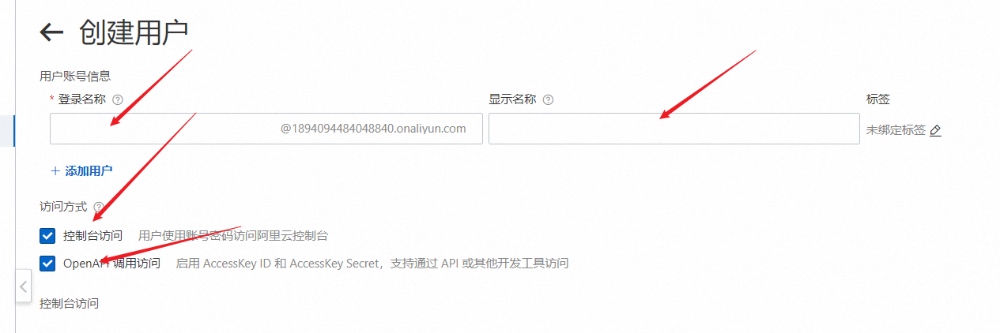

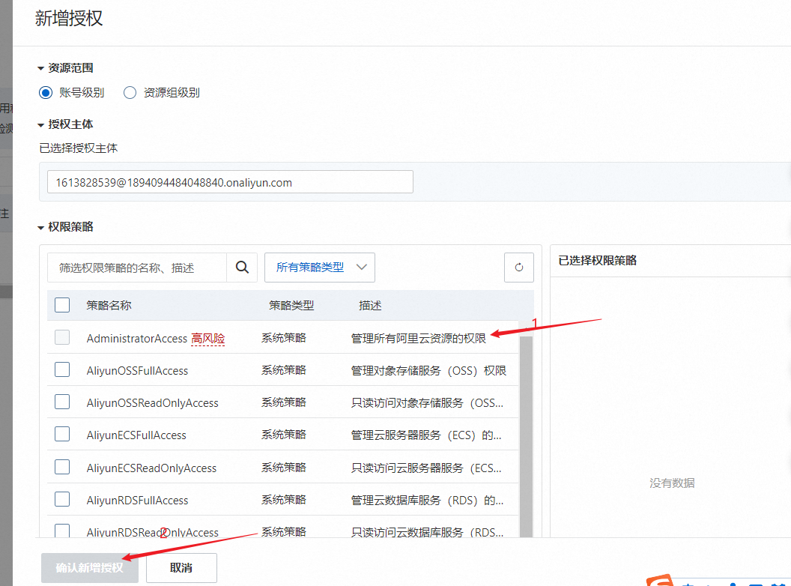

##### 5.2.2 创建 ACCESS_KEY

为用户生成 ACCESS_KEY，用于访问 OSS 服务。

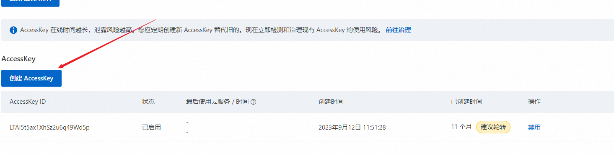

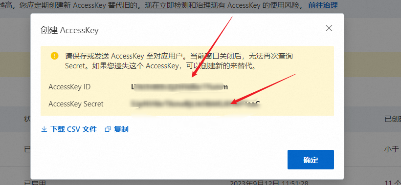

##### 5.2.3 配置环境变量

设置环境变量以方便在代码中使用 ACCESS_KEY：

```bash
setx OSS_ACCESS_KEY_ID <ALIBABA_CLOUD_ACCESS_KEY_ID>
setx OSS_ACCESS_KEY_SECRET <ALIBABA_CLOUD_ACCESS_KEY_SECRET>
```

##### 5.2.4 测试环境变量

通过以下 Java 代码测试环境变量是否设置成功：

```java
public class TestEnv {
    public static void main(String[] args) {
        System.out.println(System.getenv("OSS_ACCESS_KEY_ID"));
        System.out.println(System.getenv("OSS_ACCESS_KEY_SECRET"));
    }
}
```

#### 5.2.5 测试代码

以下是一个使用 Java SDK 访问 OSS 的示例代码：

```java
import com.aliyun.oss.ClientException;
import com.aliyun.oss.OSS;
import com.aliyun.oss.OSSClientBuilder;
import com.aliyun.oss.OSSException;
import com.aliyun.oss.common.auth.CredentialsProviderFactory;
import com.aliyun.oss.common.auth.EnvironmentVariableCredentialsProvider;
import java.io.ByteArrayInputStream;

public class Demo {

    public static void main(String[] args) throws Exception {
        // 设置 Endpoint，以下示例以华东1（杭州）为例。
        String endpoint = "https://oss-cn-hangzhou.aliyuncs.com";
        // 从环境变量中获取访问凭证。请确保已设置环境变量 OSS_ACCESS_KEY_ID 和 OSS_ACCESS_KEY_SECRET。
        EnvironmentVariableCredentialsProvider credentialsProvider = CredentialsProviderFactory.newEnvironmentVariableCredentialsProvider();
        // 填写 Bucket 名称，例如 examplebucket。
        String bucketName = "examplebucket";
        // 填写 Object 完整路径，例如 exampledir/exampleobject.txt。路径中不能包含 Bucket 名称。
        String objectName = "exampledir/exampleobject.txt";

        // 创建 OSSClient 实例。
        OSS ossClient = new OSSClientBuilder().build(endpoint, credentialsProvider);

        try {
            String content = "Hello OSS";
            // 上传对象到 OSS。
            ossClient.putObject(bucketName, objectName, new ByteArrayInputStream(content.getBytes()));
        } catch (OSSException oe) {
            // 捕获 OSS 异常。
            System.out.println("Caught an OSSException, which means your request made it to OSS, "
                    + "but was rejected with an error response for some reason.");
            System.out.println("Error Message:" + oe.getErrorMessage());
            System.out.println("Error Code:" + oe.getErrorCode());
            System.out.println("Request ID:" + oe.getRequestId());
            System.out.println("Host ID:" + oe.getHostId());
        } catch (ClientException ce) {
            // 捕获客户端异常。
            System.out.println("Caught a ClientException, which means the client encountered "
                    + "a serious internal problem while trying to communicate with OSS, "
                    + "such as not being able to access the network.");
            System.out.println("Error Message:" + ce.getMessage());
        } finally {
            if (ossClient != null) {
                ossClient.shutdown();
            }
        }
    }
}
```

