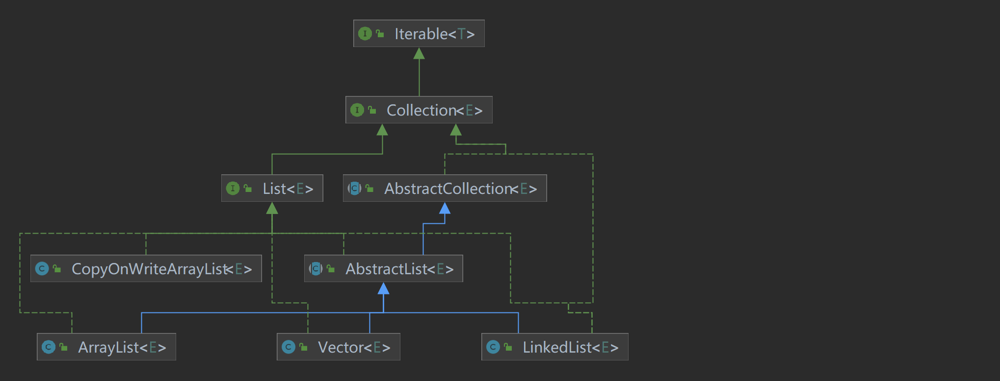
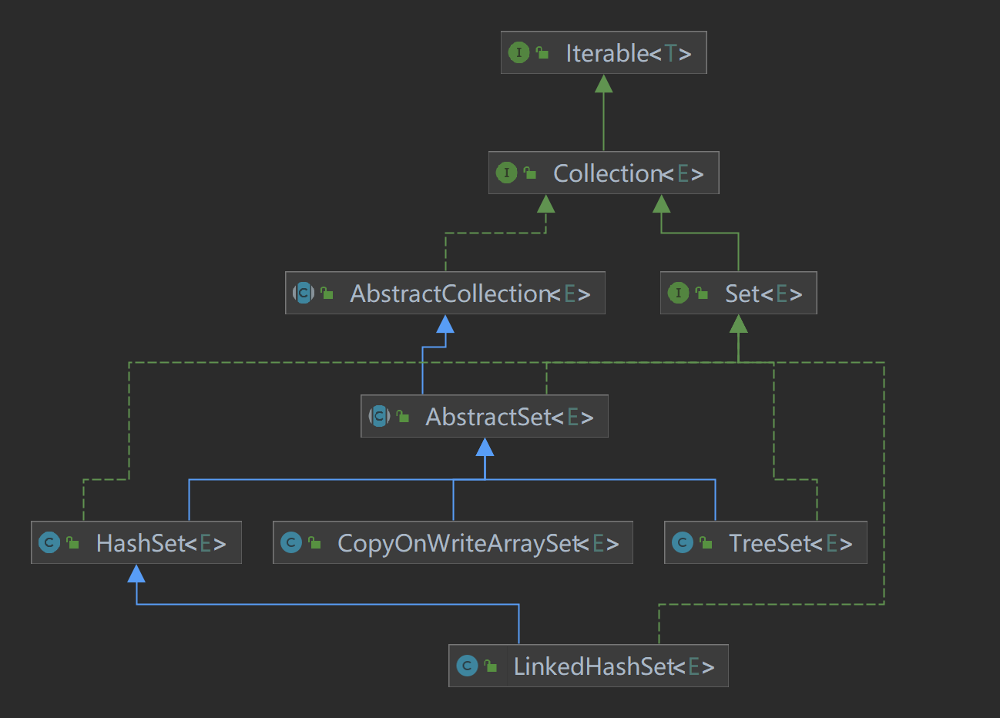
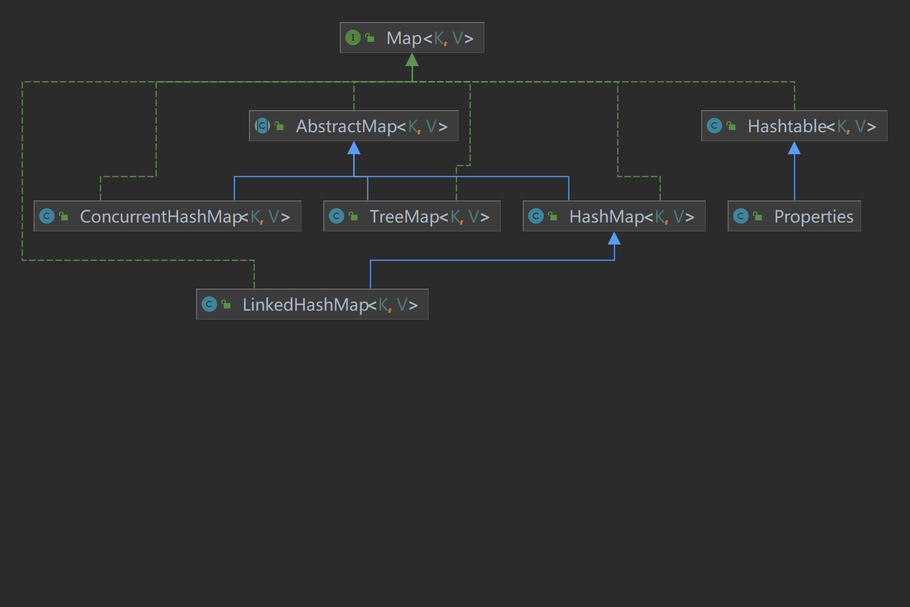

### 1.List图解

1. **ArrayList**：
   - 优势：
     - 随机访问速度快：由于 `ArrayList` 基于数组实现，可以通过索引进行快速随机访问。
     - 内存占用较小：相对于 `LinkedList` 和 `Vector`，`ArrayList` 内存占用较小，因为它不会维护额外的链表结构或同步开销。
   - 适用场景：
     - 当需要快速随机访问元素时，特别是按索引查找元素时，`ArrayList` 是一个很好的选择。
     - 当元素数量相对稳定，不需要频繁进行插入和删除操作时，`ArrayList` 效率较高。
2. **LinkedList**：
   - 优势：
     - 插入和删除操作高效：由于 `LinkedList` 基于链表实现，插入和删除操作的时间复杂度为 O(1)。
     - 内存动态分配：`LinkedList` 在插入和删除元素时不需要重新分配内存，因此在频繁插入和删除元素的情况下，性能可能优于 `ArrayList`。
   - 适用场景：
     - 当需要频繁进行插入和删除操作时，尤其是在集合的中间位置进行操作时，`LinkedList` 是一个不错的选择。
     - 当对内存占用不那么敏感，而对于插入和删除操作的效率要求较高时，可以考虑使用 `LinkedList`。
3. **Vector**：
   - 优势：
     - 线程安全：`Vector` 是线程安全的，支持并发访问，所有公共方法都被 synchronized 修饰。
     - 可增长的数组：与 `ArrayList` 类似，`Vector` 也是基于数组实现的，并且支持动态增长。
   - 适用场景：
     - 当需要在多线程环境下进行操作时，`Vector` 可以确保线程安全，适合于并发访问的场景。
     - 尽管 `Vector` 在现代 Java 中不太常用，但如果你需要一个线程安全的动态数组，可以考虑使用 `Vector`。
4. **CopyOnWriteArrayList**：
   - 优势：
     - 线程安全且高效的迭代：`CopyOnWriteArrayList` 是线程安全的，它通过复制原数组来实现并发更新，因此对迭代操作非常高效。
     - 适用于读多写少的场景：由于写操作会复制整个数组，因此适用于写少、读多的场景。
   - 适用场景：
     - 当需要在读多写少的场景下保证线程安全且高效的迭代时，`CopyOnWriteArrayList` 是一个很好的选择。
     - 例如，可以用于观察者模式中，当需要多个观察者同时观察一个对象，并且观察者只读取对象状态而不修改时。

### 2.Set图解

1. **HashSet**：
   - 优势：
     - 快速查找：`HashSet` 基于哈希表实现，具有快速的查找性能，平均时间复杂度为 O(1)。
     - 不允许重复元素：`HashSet` 不允许集合中存在重复元素，保证了元素的唯一性。
   - 适用场景：
     - 当需要快速查找元素，并且不关心元素的顺序时，`HashSet` 是一个很好的选择。
     - 适合于需要去重的场景，例如在构建索引、缓存或者判断元素是否存在时使用。
2. **TreeSet**：
   - 优势：
     - 有序性：`TreeSet` 基于红黑树实现，可以保证元素按照自然顺序或者指定的比较器顺序排序。
     - 支持范围查找：`TreeSet` 支持范围查询操作，例如 `subSet()`, `headSet()`, `tailSet()` 等。
   - 适用场景：
     - 当需要保持元素有序，并且进行范围查询操作时，`TreeSet` 是一个很好的选择。
     - 适合于需要按照一定顺序遍历集合中元素的场景，例如需要按照字母顺序或者数值大小顺序进行遍历。
3. **LinkedHashSet**：
   - 优势：
     - 有序性和快速访问：`LinkedHashSet` 同时具有 `HashSet` 的快速查找特性和 `LinkedHashMap` 的有序性，内部使用链表维护插入顺序。
     - 迭代顺序可预测：遍历 `LinkedHashSet` 时，元素的顺序与插入顺序一致。
   - 适用场景：
     - 当需要保持元素的插入顺序，并且快速访问元素时，`LinkedHashSet` 是一个很好的选择。
     - 适合于需要维护元素插入顺序的场景，例如LRU缓存算法中。
4. **CopyOnWriteArraySet**：
   - 优势：
     - 线程安全：`CopyOnWriteArraySet` 是线程安全的，通过复制原数组来实现并发更新，支持高效的读操作。
     - 适用于读多写少的场景：对集合进行写操作时，会复制整个数组，因此适用于读多写少的场景。
   - 适用场景：
     - 当需要在读多写少的场景下保证线程安全，并且需要高效的读操作时，`CopyOnWriteArraySet` 是一个很好的选择。
     - 例如，用于缓存、事件监听器集合等需要多线程安全的场景。

### 3.Map图解

1. **TreeMap**：
   - 优势：
     - 有序性：`TreeMap` 基于红黑树实现，可以保持键的有序性，这使得它适用于需要按照键的顺序进行遍历和操作的场景。
     - 支持范围查询：`TreeMap` 支持范围查询操作，例如 `subMap()`, `headMap()`, `tailMap()` 等。
   - 适用场景：
     - 当需要按照键的自然顺序或者指定的比较器顺序对键进行排序，并且进行范围查询操作时，`TreeMap` 是一个很好的选择。
     - 适合于需要有序遍历键值对的场景，例如按照字母顺序或者数值大小顺序进行遍历。
2. **HashMap**：
   - 优势：
     - 高性能：`HashMap` 基于哈希表实现，具有快速的插入、删除和查找操作，平均时间复杂度为 O(1)。
     - 可变大小：`HashMap` 不限制容量，可以根据需要动态调整大小。
   - 适用场景：
     - 当需要快速插入、删除和查找键值对，并且不需要保持任何顺序时，`HashMap` 是一个很好的选择。
     - 适合于需要高性能的哈希映射的场景，例如缓存、索引等。
3. **LinkedHashMap**：
   - 优势：
     - 有序性：`LinkedHashMap` 继承自 `HashMap`，但内部使用链表维护插入顺序，因此可以保持插入顺序。
     - 迭代顺序可预测：遍历 `LinkedHashMap` 时，键值对的顺序与插入顺序一致。
   - 适用场景：
     - 当需要保持键值对的插入顺序时，`LinkedHashMap` 是一个很好的选择。
     - 适合于需要按照元素插入顺序遍历键值对的场景，例如LRU缓存算法中。
4. **ConcurrentHashMap**：
   - 优势：
     - 线程安全：`ConcurrentHashMap` 是线程安全的哈希映射，支持并发访问而不需要额外的同步措施。
     - 高性能：`ConcurrentHashMap` 通过分段锁机制实现高效的并发更新，可以同时支持多个写操作和多个读操作。
   - 适用场景：
     - 当需要在多线程环境下安全地进行并发访问和更新操作时，`ConcurrentHashMap` 是一个很好的选择。
     - 适合于需要高并发性能和线程安全的场景，例如并发缓存、并行计算等。
5. **Hashtable**：
   - 优势：
     - 线程安全：`Hashtable` 是线程安全的哈希映射，所有公共方法都是同步的，支持多线程并发访问。
     - 可靠性：由于所有的方法都是同步的，`Hashtable` 在多线程环境下可以提供可靠的线程安全性。
   - 适用场景：
     - 当需要在多线程环境下安全地进行并发访问和更新操作，并且需要保证线程安全性和可靠性时，`Hashtable` 是一个选择。
     - 然而，由于其同步开销较高，一般情况下 `ConcurrentHashMap` 更常被选择。
6. **Properties**：
   - 优势：
     - 用于处理属性文件：`Properties` 是一个专门用来处理属性文件（key-value对）的集合类，通常用于配置文件的读取和写入。
     - 字符串类型：`Properties` 的键和值都是字符串类型，适合于存储简单的配置信息。
   - 适用场景：
     - 当需要读取或者写入配置文件时，特别是简单的键值对配置信息时，`Properties` 是一个很好的选择。
     - 适合于处理简单的文本配置文件，例如应用程序的配置信息、国际化资源文件等。