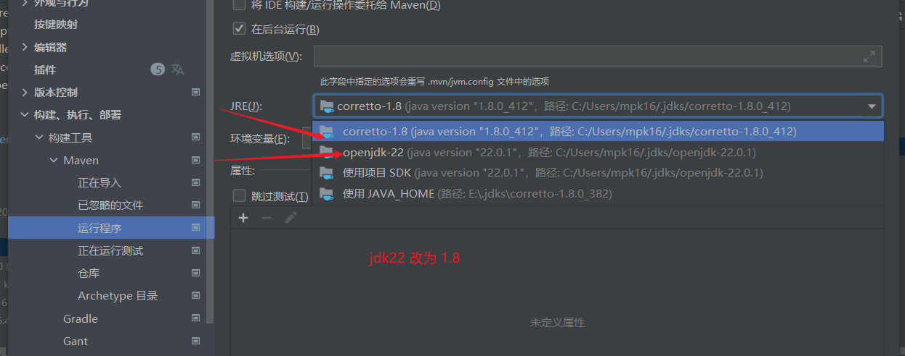

## 1.mybatis-plus依赖

C:\Users\mpk16\Downloads\apartment-system\src\main\java\com\one\apartmentsystem\ApartmentSystemApplication.java:3:37

java: 无法访问org.mybatis.spring.annotation.MapperScan
  错误的类文件: /E:/Maven/apache-maven-3.9.4-bin/apache-maven-3.9.4/repo/org/mybatis/mybatis-spring/3.0.3/mybatis-spring-3.0.3.jar!/org/mybatis/spring/annotation/MapperScan.class
    类文件具有错误的版本 61.0, 应为 52.0
    请删除该文件或确保该文件位于正确的类路径子目录中。

```xml
将<dependency>  
    <groupId>com.baomidou</groupId>  
    <artifactId>mybatis-plus-spring-boot3-starter</artifactId>    <version>3.5.7</version>
</dependency>
改为

    <dependency>
            <groupId>com.baomidou</groupId>
            <artifactId>mybatis-plus-boot-starter</artifactId>
            <version>3.4.2</version>
        </dependency>
```

## 2.tomcat依赖

java: 无法访问jakarta.servlet.http.HttpSession
  错误的类文件: /E:/Maven/apache-maven-3.9.4-bin/apache-maven-3.9.4/repo/org/apache/tomcat/embed/tomcat-embed-core/10.1.26/tomcat-embed-core-10.1.26.jar!/jakarta/servlet/http/HttpSession.class
    类文件具有错误的版本 55.0, 应为 52.0
    请删除该文件或确保该文件位于正确的类路径子目录中。

```xml
删除依赖
<dependency>    
<groupId>org.apache.tomcat.embed</groupId> 
<artifactId>tomcat-embed-core</artifactId>   
<version>10.1.26</version>
</dependency>
```

## 3.MockMultipartFile

java: 无法访问org.springframework.mock.web.MockMultipartFile
  错误的类文件: /E:/Maven/apache-maven-3.9.4-bin/apache-maven-3.9.4/repo/org/springframework/spring-test/6.1.11/spring-test-6.1.11.jar!/org/springframework/mock/web/MockMultipartFile.class
    类文件具有错误的版本 61.0, 应为 52.0
    请删除该文件或确保该文件位于正确的类路径子目录中。

```xml
<dependency>    
<groupId>org.springframework</groupId>  
<artifactId>spring-test</artifactId> 
<version>6.1.11</version>
</dependency>

<dependency>    
<groupId>org.springframework</groupId>  
<artifactId>spring-test</artifactId> 
</dependency>
```

## 4.lombok

Class com.sun.tools.javac.tree.JCTree$JCImport does not have member field 'com.sun.tools.javac.tree.JCTree qualid'

打包时出现问题

```xml
<dependency>   
<groupId>org.projectlombok</groupId>  
<artifactId>lombok</artifactId>   
</dependency>
```

